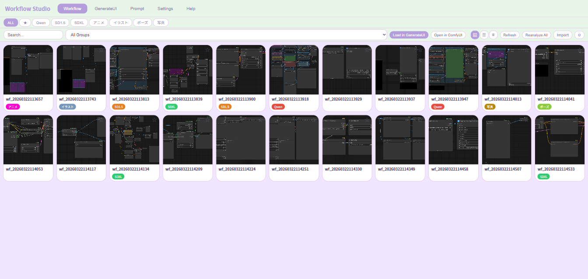
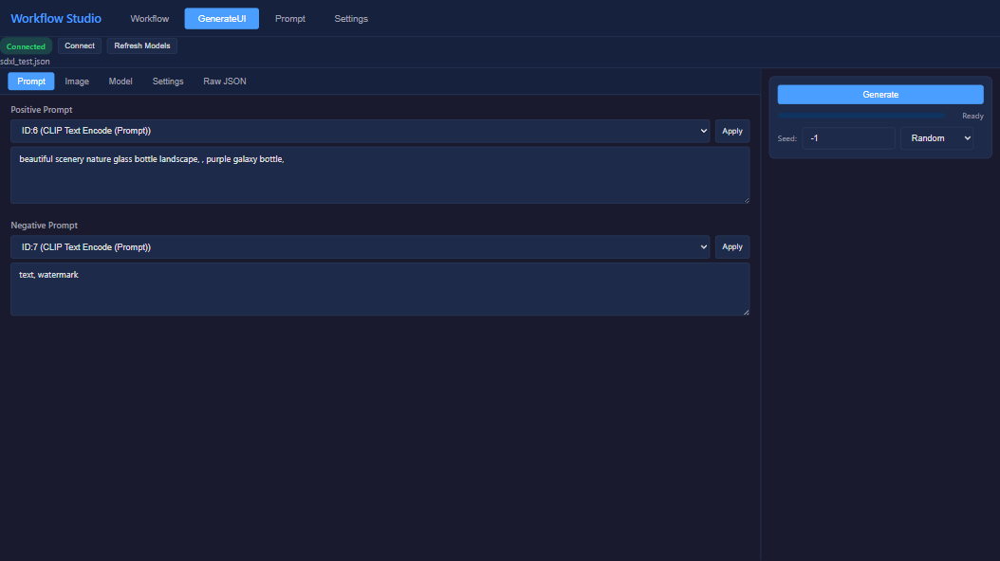
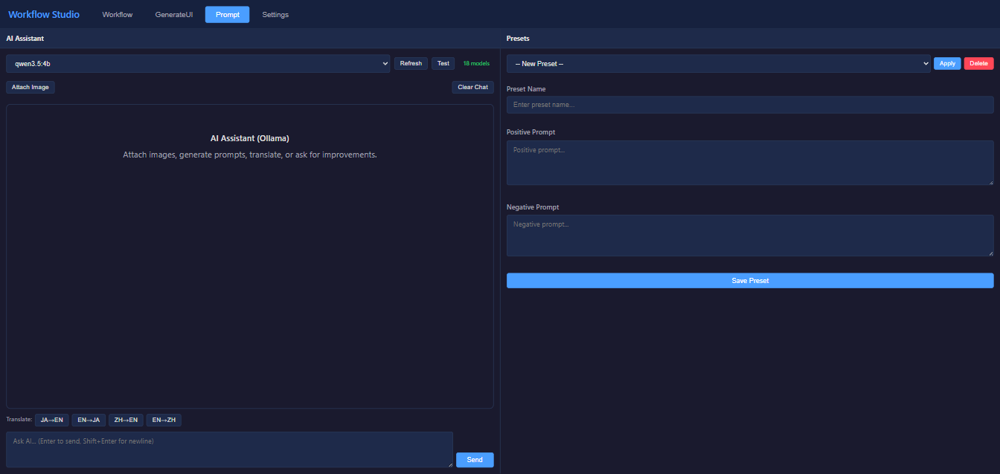
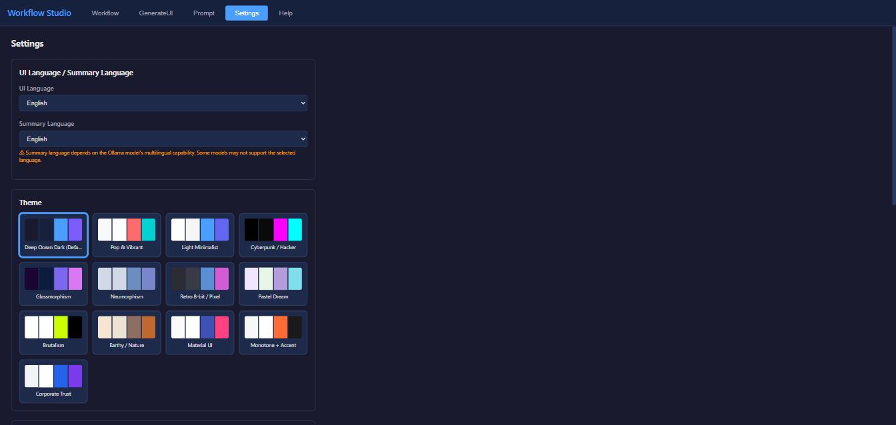
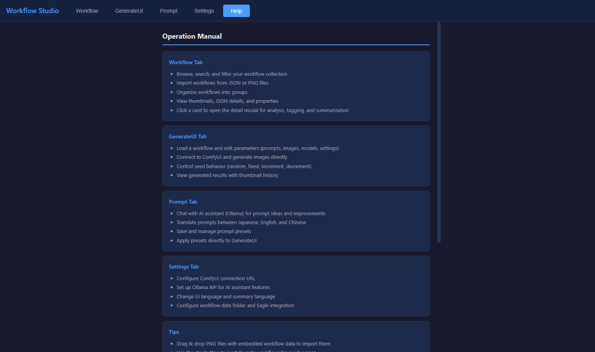
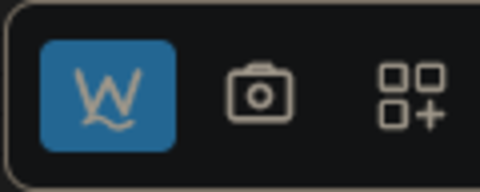

# ComfyUI-Workflow-Studio

A comprehensive workflow management and generation UI plugin for [ComfyUI](https://github.com/comfyanonymous/ComfyUI).

Browse, organize, and execute workflows directly from a dedicated studio interface — without switching between windows or manually editing JSON.


## Screenshots

| Workflow Tab | GenerateUI Tab |
|:---:|:---:|
|  |  |

| Prompt Tab | Settings Tab |
|:---:|:---:|
|  |  |

| Help & Support Tab | ComfyUI Integration |
|:---:|:---:|
|  |  |

---

## Features

### Workflow Tab
- **Thumbnail / Card / Table views** — switch between view modes to browse your workflow library
- **Thumbnail side panel** — preview workflow canvas snapshots in the side panel
- **Tag-based filtering** — filter by base model (SD1.5, SDXL, etc.) and custom groups
- **Search** — full-text search across workflow names and metadata
- **Side panel tabs** — Thumbnail preview, JSON viewer with syntax highlighting, and Group management
- **Batch analysis** — auto-detect checkpoint, model type, prompt, and I/O node counts
- **AI summary** — generate workflow descriptions using Ollama
- **Import / Export** — import workflows from files or clipboard, open in ComfyUI directly
- **Default view setting** — persist your preferred view mode (Thumbnail / Card / Table)

### Canvas Snapshot (v0.1.2)
- **One-click capture** — click the camera button in ComfyUI's top bar to snapshot the current workflow canvas
- **Auto-save as thumbnail** — the snapshot is saved directly to the workflow data folder as a PNG thumbnail
- **Embedded workflow metadata** — workflow JSON is embedded in the PNG (tEXt chunk), compatible with ComfyUI's drag-and-drop import
- **Auto-import** — the captured workflow is automatically imported and appears in the Workflow tab

### GenerateUI Tab
- **Auto-generated parameter UI** — prompt, model, sampler, image, and other settings extracted from the workflow
- **One-click generation** — queue prompts to ComfyUI without leaving the studio
- **Seed control** — randomize, lock, or manually set seeds
- **Raw JSON editor** — view and edit the API-format JSON with syntax highlighting
- **UI-to-API conversion** — automatic conversion supporting subgraphs (nested workflows), COMBO types, and display-only node exclusion
- **Eagle integration** — auto-save generated images to [Eagle](https://eagle.cool/) with metadata

### Prompt Tab
- **Split-panel layout** — AI assistant and presets displayed side-by-side for simultaneous use
- **AI chat assistant** — powered by [Ollama](https://ollama.com/), generate and refine prompts interactively
- **Image attachment** — attach reference images for vision-capable models
- **Translation** — JA/EN/ZH translation buttons for multilingual prompt creation
- **Prompt presets** — save/load reusable prompt templates (positive & negative)
- **Clipboard copy** — copy positive/negative prompts individually for use in ComfyUI
- **Apply to GenerateUI** — send prompts directly to the generation interface

### Settings Tab
- **Theme selection** — 13 built-in themes with visual swatch preview (Dark, Pop, Minimalist, Cyberpunk, Glassmorphism, Neumorphism, Retro Pixel, Pastel, Brutalism, Earthy, Material, Monotone, Corporate)
- **Workflows directory** — configure which folder to scan for workflows
- **Eagle connection** — set Eagle API endpoint for auto-save
- **Ollama connection** — configure Ollama server URL
- **Badge display** — toggle metadata badges on workflow cards
- **Language** — English / Japanese / Chinese

### Help & Support Tab (v0.1.3)
- **Feature list** — overview of all features organized by tab
- **Tips** — quick tips for drag & drop import, favorites, and default workflow
- **Support links** — GitHub repository and Ko-fi donation page

---

## Installation

### Via ComfyUI Manager (Recommended)

Search for **Workflow Studio** in ComfyUI Manager and install.

### Manual Installation

```bash
cd ComfyUI/custom_nodes
git clone https://github.com/ketle-man/ComfyUI-Workflow-Studio.git
```

Restart ComfyUI after installation.

---

## Usage

### Launch

Click the **W** button in the ComfyUI top menu bar, or navigate to:

```
http://127.0.0.1:8188/wfm
```

> **Tip:** Shift+Click the W button to open in a new window.

### Canvas Snapshot

Click the **camera icon** (next to the W button) in ComfyUI's top bar to capture the current workflow canvas as a thumbnail. The image is automatically saved to the workflow data folder and appears in Workflow Studio's workflow list.

### Quick Start

1. **Workflow Tab** — Your workflows from `ComfyUI/user/default/workflows/` are automatically listed
2. **Click a workflow** — View thumbnail, JSON details, and metadata in the side panel
3. **Load in GenerateUI** — Click the button to load a workflow into the generation interface
4. **Adjust parameters** — Modify prompts, models, seeds, and settings via the auto-generated UI
5. **Generate** — Hit the Generate button to queue the prompt

---

## Requirements

- **ComfyUI** — any recent version (v1.33.9+ recommended for action bar integration)
- **Python 3.10+**
- **Jinja2** — `pip install jinja2` (usually included with ComfyUI)

### Optional

- **[Ollama](https://ollama.com/)** — for AI chat assistant and translation features
- **[Eagle](https://eagle.cool/)** — for auto-saving generated images with metadata

---

## Supported Languages

| Language | Status |
|----------|--------|
| English  | Full   |
| Japanese | Full   |
| Chinese  | Full   |

---

## Changelog

### v0.1.5
- **Theme system** — 13 built-in themes selectable from Settings tab with instant preview (Deep Ocean Dark, Pop & Vibrant, Light Minimalist, Cyberpunk, Glassmorphism, Neumorphism, Retro 8-bit, Pastel Dream, Brutalism, Earthy, Material UI, Monotone + Accent, Corporate Trust)
- Theme preference persisted in localStorage and restored on page load (no flash)
- Special CSS effects per theme: neon glow (Cyberpunk), backdrop blur (Glassmorphism), dual shadow (Neumorphism), pixel borders (Retro/Brutalism)

### v0.1.4
- **App format support** — detect `.app.json` workflows (ComfyUI App mode), show "App Format" badge, block loading in GenerateUI with guidance message
- **Preset clipboard copy** — added PP Copy / NP Copy buttons to copy positive/negative prompts to clipboard
- **Analysis bugfix** — fixed workflow analysis crash when `widgets_values` contains non-string values (e.g. integers)

### v0.1.3
- Added **Help & Support tab** — feature list, tips, and support links (GitHub, Ko-fi)
- Multi-language support (EN/JA/ZH) for all help content

### v0.1.2
- Added **Canvas Snapshot** button to ComfyUI top bar — capture workflow canvas as PNG thumbnail with embedded workflow metadata
- Added **Thumbnail tab** to the workflow side panel for quick visual preview
- Added **Thumbnail section** to the workflow detail modal
- Snapshot images are auto-imported as workflows with thumbnails

### v0.1.1
- Initial feature set: Workflow management, GenerateUI, Prompt assistant, Settings

---

## Project Structure

```
ComfyUI-Workflow-Studio/
├── __init__.py                  # ComfyUI entry point
├── py/
│   ├── wfm.py                   # Main class & route registration
│   ├── config.py                # Path configuration
│   ├── routes/
│   │   ├── workflow_routes.py   # Workflow CRUD & analysis API
│   │   ├── settings_routes.py   # Settings API
│   │   ├── ollama_routes.py     # Ollama proxy API
│   │   └── eagle_routes.py      # Eagle integration API
│   └── services/
│       ├── workflow_service.py  # Workflow file operations
│       ├── workflow_analyzer.py # Model/node detection
│       ├── settings_service.py  # Settings persistence
│       └── png_extractor.py     # PNG metadata extraction
├── templates/
│   └── index.html               # SPA template (Workflow/GenerateUI/Prompt/Settings/Help)
├── static/
│   ├── favicon.svg              # Browser tab icon (W+S Wave)
│   ├── css/main.css             # Styles
│   └── js/
│       ├── app.js               # App initialization & routing
│       ├── workflow-tab.js      # Workflow browser
│       ├── generate-tab.js      # Generation UI
│       ├── prompt-tab.js        # AI assistant & presets
│       ├── settings-tab.js      # Settings panel
│       ├── comfyui-client.js    # ComfyUI WebSocket/API client
│       ├── comfyui-workflow.js  # UI-to-API format conversion
│       ├── comfyui-editor.js    # Dynamic parameter editor
│       ├── json-highlight.js    # JSON syntax highlighting
│       └── i18n.js              # Internationalization
├── web/comfyui/
│   └── top_menu_extension.js    # ComfyUI menu bar integration
└── data/                        # Metadata & settings storage
```

---

## License

MIT License

---

## Acknowledgements

- [ComfyUI](https://github.com/comfyanonymous/ComfyUI) by comfyanonymous
- [ComfyUI-Custom-Scripts](https://github.com/pythongosssss/ComfyUI-Custom-Scripts) by pythongosssss — Canvas snapshot and PNG workflow embedding implementation reference
- [ComfyUI-Lora-Manager](https://github.com/willchil/ComfyUI-Lora-Manager) — Plugin architecture and UI pattern reference
- [Ollama](https://ollama.com/) for local LLM inference
- [Eagle](https://eagle.cool/) for image management
