# ComfyUI-Workflow-Studio

A comprehensive workflow, asset management, and generation UI plugin for [ComfyUI](https://github.com/comfyanonymous/ComfyUI).

**📁 Management** — organize all your assets in one studio
- Workflow, model, image, and prompt management
- AI-powered prompt writing assistance, translation, and tag generation
- File drop & Gallery-linked metadata viewing — inspect and reuse generation settings instantly

**⚡ GenerateUI** — a productivity-focused generation tab connected to every other tab
- Batch generation across models, samplers, prompts, and workflows
- Image Feeder for continuous folder-based generation

**📚 Workflow Studio Library** — a multi-function side panel for smooth ComfyUI integration
- Drag & drop models, nodes, prompts, and workflows straight onto the canvas
- **Send to Canvas**: click "Send to Canvas" (Workflow tab) or "Copy & Send Canvas" (Gallery tab) to send the workflow directly to the ComfyUI canvas — UI and API formats both supported
- View metadata from images / JSON, then drop the detected models and prompts onto the canvas
- Built-in AI tools (translation and more)


## Screenshots

| Workflow Tab | Models Tab |
|:---:|:---:|
| 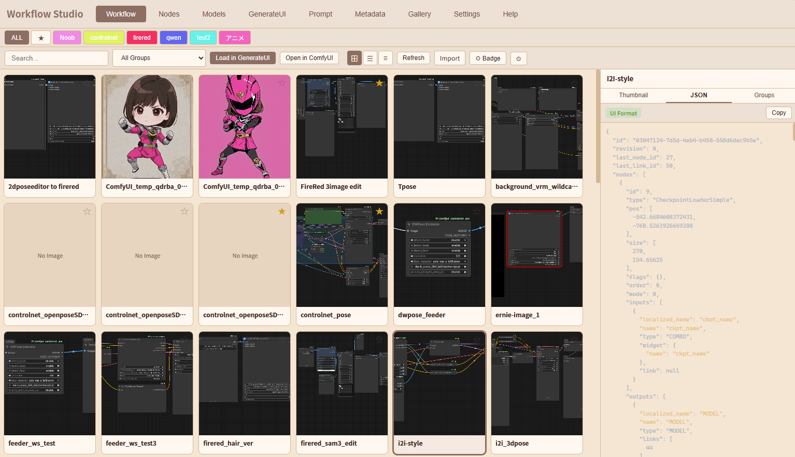 | 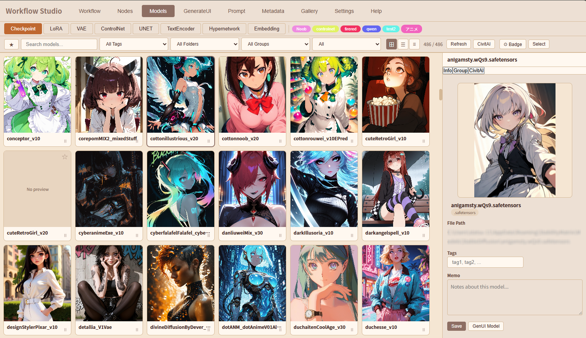 |

| Prompt Input Assistance | Gen UI Feeder |
|:---:|:---:|
| 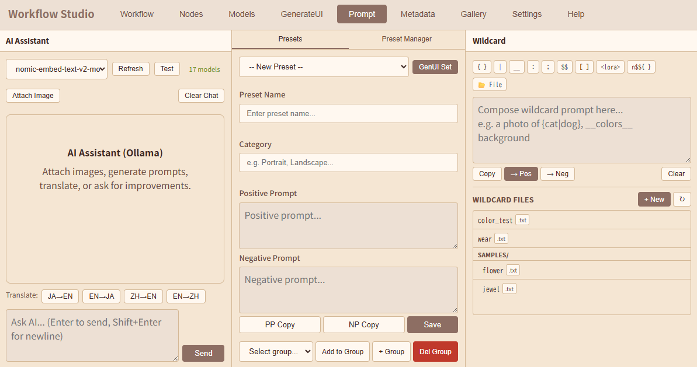 | 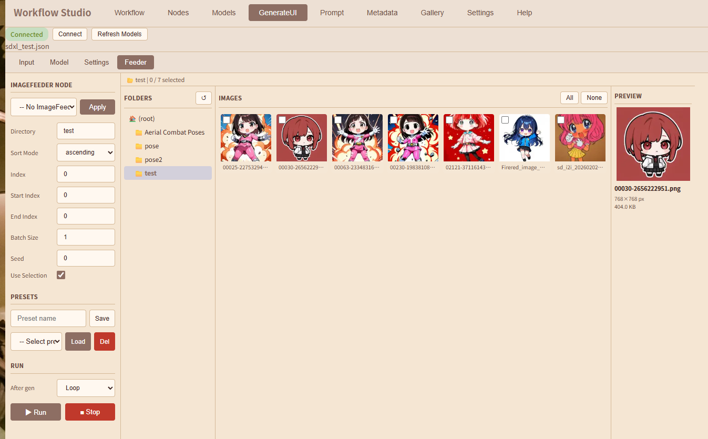 |

| GenUI LoRA Stack | GenUI Batch |
|:---:|:---:|
| 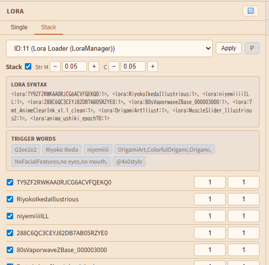 | 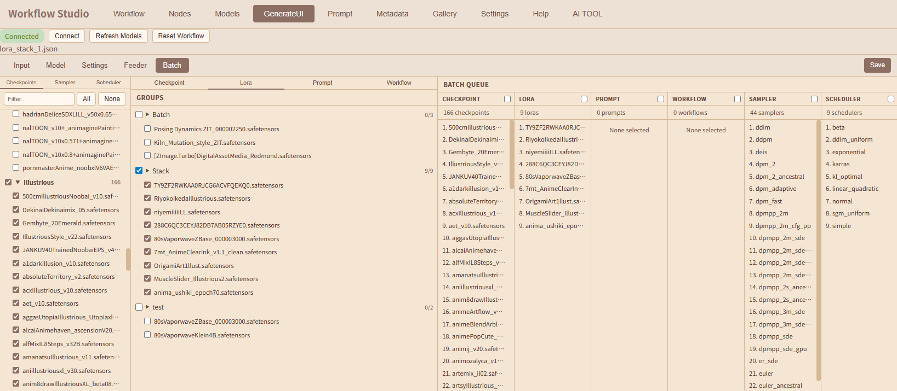 |

| Models Multi-select Menu | Top Bar |
|:---:|:---:|
| 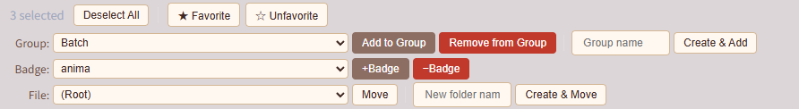 | 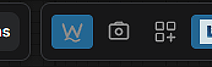 |

| WS Library | Library Information |
|:---:|:---:|
| 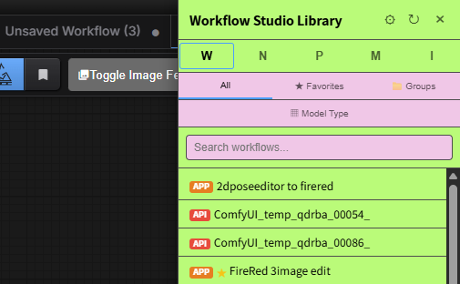 | 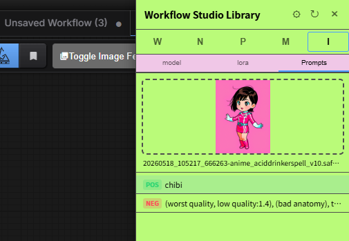 |

| Customize | |
|:---:|:---:|
| 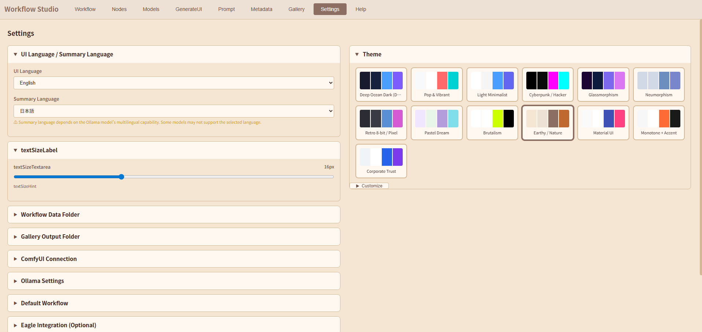 | |

---

## Features

### Workflow Tab
- **Thumbnail / Table views** — switch between view modes to browse your workflow library
- **Thumbnail side panel** — preview workflow canvas snapshots in the side panel
- **Badge filtering** — filter by user-defined badges (free labels you assign to each workflow)
- **Search** — full-text search across workflow names and metadata
- **Side panel tabs** — Thumbnail preview, JSON viewer with syntax highlighting, and Group management
- **Badge management** — add, rename, delete badges with custom colors shared with the Models tab (⚙ Badge button)
- **AI summary** — generate workflow descriptions using Ollama
- **Import / Export** — import workflows from files or clipboard; **Send to Canvas** button sends the selected workflow directly to the ComfyUI canvas (UI and API formats both supported)
- **Default view setting** — persist your preferred view mode (Thumbnail / Table)

### Canvas Snapshot (v0.1.2)
- **One-click capture** — click the camera button in ComfyUI's top bar to snapshot the current workflow canvas
- **Auto-save as thumbnail** — the snapshot is saved directly to the workflow data folder as a PNG thumbnail
- **Embedded workflow metadata** — workflow JSON is embedded in the PNG (tEXt chunk), compatible with ComfyUI's drag-and-drop import
- **Auto-import** — the captured workflow is automatically imported and appears in the Workflow tab

### GenerateUI Tab (v0.3.5)
- **5-tab layout** — Input / Model / Settings / Feeder / Batch tabs; Input, Model, and Settings each include a Raw JSON column on the right for instant preview and direct editing
- **Save button** — located at the right end of the subtab row; opens a filename dialog (default: current workflow name) and saves the current workflow as a `.json` file to the Workflow tab via the import API
- **Input tab** — Prompt and Image inner tabs (drag-and-drop upload); Prompt tab shows Positive Prompt and Negative Prompt textareas, plus an **Embeddings selector** at the bottom (Filter + Select + Weight input + Paste button); Paste inserts `(embedding:Name:weight)` at the cursor position of the last focused textarea (defaults to Positive when neither is focused); Raw JSON (540px) in the right column
- **Model tab** — Checkpoint, VAE, LoRA, ControlNet, UNET, TextEncoder, **Hypernetwork** (with Strength field) selectors with filter; Raw JSON on the right
- **Settings tab** — KSampler and Latent Image side by side at 50% width each; Raw JSON on the right
- **Always-visible Raw JSON** — edit the API-format JSON directly from any tab with syntax highlighting; Apply button reloads the workflow; built-in **search bar** (always shown) finds all matches as you type with count display (`3/12`); navigate with ↑/↓ buttons or Enter / Shift+Enter; Escape or ✕ clears; current match highlighted in orange, other matches in yellow
- **One-click generation** — queue prompts to ComfyUI without leaving the studio
- **Seed control** — randomize, lock, or manually set seeds; seed input and mode selector stacked vertically for readability
- **Batch type selector** — check one of the column header checkboxes in the Batch Queue pane (Checkpoint / Lora / Prompt / Workflow) to activate that batch type; only one type can be active at a time; the Batch panel below Generate shows the active type, progress, and Pause/Resume/Stop controls
- **Batch tab** (v0.3.18) — dedicated 3-pane layout for assembling the batch queue:
  - **Left pane** — file-tree checkpoint selection; Filter input to search; All / None buttons; initial state is all unchecked
  - **Center pane** — group-based selection with inner tabs (Checkpoint | Lora | Prompt | Workflow); Checkpoint/Lora groups come from the Models tab, Prompt groups from the Prompt tab, Workflow groups from the Workflow tab — check a group to add all its members, expand ▶ to select individually
  - **Right pane (Batch Queue)** — shows items queued for each batch type; column headers (Checkpoint / Lora / Prompt / Workflow) each have a checkbox — check one to activate that batch type (radio behavior: only one at a time); count shown at top
- **UI-to-API conversion** — automatic conversion supporting subgraphs (nested workflows), COMBO types, and display-only node exclusion; improved analysis covers SDXL multi-hop CONDITIONING chains, CLIPTextEncodeSDXL, SDXLPromptStyler, KSamplerAdvanced, and more
- **Eagle integration** — auto-save generated images to [Eagle](https://eagle.cool/) with metadata

### Feeder subtab (v0.3.5 / v0.3.42)
Two independent modes selectable via **[Image Loop] / [Gallery]** toggle buttons at the top of the left pane (persisted in `localStorage`).

**Image Loop mode** — requires the **[comfyui-image-feeder](https://github.com/ketle-man/comfyui-image-feeder)** custom node.
- **ImageFeeder node control** — select the target node from a dropdown auto-populated from the loaded workflow; edit all node parameters (Directory, Sort Mode, Index, Start/End Index, Batch Size, Seed, Use Selection) and Apply to the workflow
- **Image library** — 3-pane layout: folder tree (left) browsing `user/default/image-loop-data/`, image grid with checkbox selection (center), preview panel with resolution and file size (right)
- **Selection management** — check individual images; All / None buttons for the current folder; selected files are reflected in `selected_files` on Apply
- **Presets** — save the current directory + selection as a named preset; load or delete presets (server-side persistence via `image-feeder-presets.json`)
- **Continuous Run loop** — Run / Stop buttons below the presets; **After gen** mode controls index behavior after each generation:
  - **Loop** — advance index and wrap back to 0 when all images are exhausted (runs indefinitely)
  - **Increment** — advance index and auto-stop when all images are consumed
  - **Fixed** — always use the same index
- **Index sync** — after each generation the node returns `next_index` via WebSocket (`image_loop_node_sync`); the Index field updates automatically
- **Seed** — Run loop uses the right-pane seed setting (Random / Fixed / Increment / Decrement); the node's own Seed field only affects random sort order

**Gallery mode** (v0.3.42) — no external plugin required; uses the built-in **WFS_GalleryFeeder** custom node.
- **WFS_GalleryFeeder node** — reads images directly from a Gallery group and outputs them one at a time; inputs: `group_name`, `index`, `sort_mode` (filename_asc / filename_desc / random), `seed`
- **Node & group selector** — pick the WFS_GalleryFeeder node from the loaded workflow and choose which Gallery group to feed images from; `__Feeder__` group is auto-created on first open
- **Image grid** — center pane shows all images in the selected group; click any image to update the Index to that position
- **After Gen modes** — Loop (wrap at end and continue indefinitely), Increment (stop automatically when last image is reached), Fixed (always use the same index)
- **Run / Stop controls** — left pane Run / Stop buttons manage the generation loop; After Gen combo (loop / increment / fixed), ▶ Run, and ■ Stop widgets are also available directly on the WFS_GalleryFeeder node in the ComfyUI canvas (`gallery_feeder_extension.js`)

### Prompt Tab
- **3-column layout** — AI Assistant (left), Presets/Preset Manager tab-panel (center), Wildcard support (right)
- **AI chat assistant** — powered by [Ollama](https://ollama.com/), generate and refine prompts interactively
- **Image attachment** — attach reference images for vision-capable models
- **Translation** — JA/EN/ZH translation buttons for multilingual prompt creation
- **Prompt presets** — save/load reusable prompt templates (positive & negative) with category support
- **Preset Manager** — browse all presets, favorites, and group-based filtering with search
- **Group management** — create groups, assign/remove presets, delete groups from the Presets panel
- **Clipboard copy** — copy positive/negative prompts individually (PP Copy / NP Copy)
- **GenUI Set** — apply preset prompts directly to the GenerateUI interface
- **Wildcard input toolbar** — one-click buttons to insert `{|}`, `{n$|}`, `__|__`, `<lora::1:LBW=;>` and other wildcard syntax; wraps selected text when applicable
- **Wildcard file manager** — create, view, and edit `.txt` / `.yaml` wildcard files stored in `user/default/Workflow-Studio/wildcard/`; click a filename in the file picker to insert `__filename__` at cursor

### Metadata Tab (v0.3.8)
- **3-column layout** — Drop zone (left) | Model info (center) | LoRA + Prompt (right)
- **File drop** — drop a ComfyUI-generated PNG / WebP or workflow JSON onto the drop zone (or click to open a file picker); PNG/WebP images are shown as a preview
- **Model extraction** — automatically extracts Checkpoint, VAE, Diffusion Model, and Text Encoder names from the workflow; supports both standard and subgraph-based workflows (Flux.2 Dev/Klein, Qwen-Image-Edit/2511/Layered, Z-Image Base/Turbo, Ernie Image, WAN2.2); node types covered: UNETLoader, UnetLoaderGGUF, UNETLoaderGGUF (e.g. HiDream GGUF), CLIPLoader, DualCLIPLoader, TripleCLIPLoader, QuadrupleCLIPLoader (e.g. HiDream 4-CLIP)
- **LoRA extraction** — lists all LoRA models with `strength_model / strength_clip` values
- **Prompt extraction** — lists prompts with POS / NEG badges when positive/negative can be determined; when distinction is not possible (e.g. `SamplerCustomAdvanced`, intermediate nodes, cross-level connections), prompts are shown without a badge as plain **Text**; click any entry to view the full text below
- **Prompt actions** — Copy to clipboard, **GenUI:P/N** (set GenerateUI positive/negative prompt), **Prompt:P/N** (set Prompt tab preset positive/negative)
- **Format support** — ComfyUI PNG/WebP/JSON (standard + Flux.2 / Qwen-Image / Z-Image / Ernie Image / WAN2.2 subgraph workflows), SD WebUI, SD Forge, Fooocus
- **Format note** — supported formats and covered model types are always shown in the left column

### Settings Tab
- **2-column layout** — left column for all settings; right column shows the Theme panel fixed in place (sticky)
- **Collapsible sections** — all settings organized in accordion panels for a clean layout
- **Theme selection** — 13 built-in themes with visual swatch preview (Dark, Pop, Minimalist, Cyberpunk, Glassmorphism, Neumorphism, Retro Pixel, Pastel, Brutalism, Earthy, Material, Monotone, Corporate)
- **Theme customization** — override colors (background, surface, text, primary, accent), add background patterns (horizontal/vertical/diagonal stripes, polka dot, checkerboard, custom SVG tiling with color/opacity/scale/gap controls), and select from 16 fonts including Japanese display fonts (Google Fonts)
- **Workflows directory** — configure which folder to scan for workflows
- **Gallery output directory** — configure which output folder the Gallery tab scans for images
- **Eagle connection** — set Eagle API endpoint for auto-save
- **Ollama connection** — configure Ollama server URL
- **CivitAI Host** — choose which site opens when clicking a model link: `civitai.com` (SFW only) or `civitai.red` (unrestricted); saved to `settings.json` and synced to `localStorage` for the Models tab to use without extra fetches
- **CivitAI API Key** — optional Bearer token for authenticated CivitAI access; stored in `settings.json` (excluded from data exports); environment variable `CIVITAI_API_KEY` takes priority if set
- **Default workflow** — set a workflow to auto-load on startup
- **Data Management** — export all plugin data (settings, metadata, prompts, etc.) to a single JSON file; import to restore data (useful when migrating or reinstalling); API keys are excluded from exports for security
- **Text Size** — one slider (10–28 px) adjusts font size for all prompt and chat textareas at once: Generate UI positive/negative prompts, AI Assistant chat input, Preset prompts, Wildcard prompt and file editor, and Metadata prompt full preview; takes effect immediately and saved with Save Settings
- **RAW JSON Colors** — customize the 6 syntax highlight colors for the Raw JSON editor in Generate UI: Default Text (base), Name/Scheduler (yellow), Title (pink), Width/Height (green), Prompt/Text (cyan), Image/File (red); changes apply immediately on color pick; Reset Defaults restores the original scheme; saved to `localStorage` under `wfm_settings.jsonColors` and applied on startup
- **Wildcard Integration** — link the WFS wildcard directory to ComfyUI-Impact-Pack's `wildcards/` directory (directory junction on Windows, symlink on other OS); existing WFS wildcard files are automatically migrated; requires [ComfyUI-Impact-Pack](https://github.com/ltdrdata/ComfyUI-Impact-Pack)
- **Language** — English / Japanese / Chinese

### Gallery Tab (v0.3.44)
- **Image browser** — browse ComfyUI output images (Thumbnail / Table views) with server-side scanning optimized for 6,000+ image libraries
- **Thumbnail / Table views** — switch view modes; Favorites column shown leftmost in Table view
- **Folder management** — create subfolders ("+ New") or delete the selected folder with all contents ("Del") from the folder tree header
- **File operations** — move or delete individual images from the detail panel's Info tab; bulk Move To..., Export, and Delete File from the multi-select bar
- **Download** — hover over the image preview in the detail panel to reveal a download icon (⬇); click to download the single image
- **Multi-select** — Ctrl+click to select multiple images; Bulk Bar appears for batch operations: select group → "Add to Group" / "Remove from Group"; Favorite All / Unfavorite All; Compare (2–4 images); Move To...; **Export** (downloads all selected images as a ZIP file); Delete File
- **Image Compare** — select 2–4 images with Ctrl+click, then click "Compare" in the Bulk Bar to open a side-by-side lightbox; grid adapts to the number of selected images
- **Prompt search** — text search covers filename, tags, memo, and prompt text (A1111 `parameters` field cached on first detail panel open)
- **Server-side filtering** — filter by group, favorites, or tags with fast server-side set lookup (no full rescan)
- **Group management** — create, rename, delete groups and assign/remove images using the same 4-section panel as Models tab; **`__Feeder__`** is a reserved group (🔒 prefix) that cannot be renamed or deleted; used by the Feeder Gallery mode to define the generation queue; **FC** button in the toolbar clears all members without deleting the group
- **Thumbnail F button** — cyan overlay button (top-left of each image card) toggles the image's membership in the `__Feeder__` group; cyan and always-visible when the image is in the group; visible on hover only when inactive
- **Favorites** — star images inline without reopening the detail panel
- **Detail panel** — view filename, path, tags, groups, and metadata in a slide-out panel
- **Workflow viewer** — Metadata tab displays workflow JSON from PNG embedded data (`prompt` / `workflow` keys) or from workflow saved by the Generate UI tab; **Copy & Send Canvas** button copies the JSON to the clipboard and sends the workflow directly to the ComfyUI canvas (UI and API formats both supported)
- **Load GenUI button** — loads the embedded ComfyUI workflow from the selected image directly into the GenerateUI tab; shows a warning toast if no workflow is embedded or the format is unsupported; Metadata button is styled green, Load GenUI button uses the primary accent color
- **Workflow auto-save** — images generated from the Generate UI tab have their workflow automatically saved to gallery metadata
- **Output folder configurable** — set the scanned output folder from Settings tab
- **Performance** — server-side 256px JPEG thumbnail generation with disk cache (`data/thumb_cache/`); infinite-scroll paging (50 images per page, IntersectionObserver); folder-level mtime cache (60s TTL); bulk operations use single-request API endpoints

### Nodes Tab (v0.1.7)
- **Node Browser** — browse all installed ComfyUI nodes from `/object_info` API with Card/Table views
- **Search & Filter** — full-text search, filter by category, package, tags, groups, and favorites
- **Package badges** — color-coded badges generated from package names
- **Node detail panel** — view I/O specifications, edit tags, manage groups
- **Node Sets** — save multiple nodes + connections as reusable sets from the ComfyUI canvas
- **Right-click context menu** — "Save as Node Set" option on any node in ComfyUI

### Models Tab (v0.2.3)
- **Model Browser** — browse all installed ComfyUI models (Checkpoint, LoRA, VAE, ControlNet, UNET, TextEncoder, Hypernetwork, Embedding) with sub-tab switching
- **Thumbnail / Table views** — switch between view modes with pagination (24 items per page); Table view includes **Type** and **Base Model** columns sourced from cached CivitAI data, displayed between the Subdirectory and Extension columns; Enable/Disable column labeled **E/D**
- **Table column sort** — click any column header to sort ascending (▲), click again for descending (▼), click a third time to clear; active column highlighted in accent color
- **Search & Filter** — full-text search, filter by tags, groups, and favorites
- **User-defined badges** — assign free-label badges to models; badge colors shared with the Workflow tab palette
- **Side panel tabs** — opens to CivitAI tab by default when a model is selected; Info (file path display with click-to-copy, tags, memo), Groups management, CivitAI integration
- **CivitAI integration** — fetch model metadata by SHA256 hash; side panel shows **Type** (badge), **Base Model**, **Hash** (BLAKE3/SHA256, click to copy), trained words, tags, and model page link; model link opens in the site selected in Settings (civitai.com or civitai.red)
- **CivitAI panel — Info / Sample sub-tabs** — Info tab shows model details (name, type, base model, hash, trigger words, tags, description); Sample tab shows all sample images (count shown in tab label); clicking any image opens the full-size version in a new tab
- **CivitAI panel states** — three distinct states: not yet checked (fetch button), checked but not found on CivitAI (re-check button with notice), and found (full info display); clicking the CivitAI tab always refreshes to the latest state
- **Batch CivitAI fetch** — one-click batch fetch using `POST /model-versions/by-hash` (up to 100 models per request) with SSE progress streaming; previews are auto-saved for models without one
- **Detail modal** — preview image, CivitAI info, thumbnail change via file upload; **Delete** button permanently removes the model file and all associated sidecar files (preview images, `.json`, `.civitai.info`, `.metadata.json`, `.cm-info.json`)
- **GenUI Model button** — apply the selected model directly to the corresponding node in GenerateUI's current workflow (Checkpoint, LoRA, VAE, ControlNet, UNET, TextEncoder, Hypernetwork); **Embedding** type shows **GenUI PP** / **GenUI NP** buttons instead — appends `(embedding:Name:1.0)` to the Positive or Negative prompt of the loaded workflow; also accessible from the side panel nav bar and the detail modal
- **Group management** — create, rename, delete groups and assign/remove models; groups are scoped per model type (checkpoint groups only appear in the Checkpoint tab); Checkpoint and LoRA tabs include **B (Batch)** and **S (Stack)** quick-assign buttons per card/row for one-click group membership toggle without grid re-render
- **Table view memo** — memo column displayed in table view for quick reference
- **Preview images** — auto-detect `{model_stem}.preview.png` next to model files
- **Enable / Disable models** — hide models from ComfyUI by renaming the file extension (`.disabled` suffix); toggle per card (⏸ button), per group (Enable All / Disable All), or filter by status (All / Enabled / Disabled)
- **Multi-select & bulk operations** — click the green **Select** button to enter selection mode and check multiple models; the bulk action bar is organized in three rows:
  - **Group row** — select an existing group and **Add** / **Remove**, or type a new name and **Create & Add**
  - **Badge row** — select a badge and **+Badge** / **−Badge** to apply or remove from all selected
  - **File row** — select a destination subfolder (or type a new folder name and create it) then **Move** to relocate the model file with all sidecar files; **Delete Files** (right end) permanently removes selected models and all associated files

### Tagger Tab (v0.3.38)
- **3 sub-tabs** — Single / Batch / DB for single-image tagging, folder batch processing, and tag database management
- **Model support** — WD Tagger (ONNX, NCHW/NHWC auto-detect), SwinV2 (ONNX), DeepDanbooru (.h5, requires TensorFlow); place each model in its own subfolder under `ComfyUI/models/tagger/<model-name>/` containing the `.onnx` + `selected_tags.csv` (or `.h5` + label file)
- **Threshold sliders** — General threshold (default 0.35) and Character threshold for `character:` prefix tags (default 0.85); sliders update the display value in real time
- **Ollama VLM** — optional vision model alongside WD Tagger; set API URL and select model (↻ to refresh list); results from both models are merged into one comma-separated tag string
- **Single tab** — drag & drop an image onto the preview area or click Upload; Gallery detail panel **Tagger** button opens the selected image directly here
- **Single output options** — (1) **GenUI:P** — appends tags to the GenerateUI tab's positive prompt and immediately applies to the loaded workflow; (2) **Send to Prompt** — appends tags to the Prompt tab's positive textarea; (3) **Save to Gallery** — saves tags to Gallery image metadata (requires image opened from Gallery); (4) **Write to File** — embeds tags into JPEG EXIF (`ImageDescription`) or PNG `tEXt` chunk (`Tags` key), other formats get a `.tags.json` sidecar; (5) **Save to DB** — stores in internal SQLite database
- **Batch tab** — enter a folder path, configure WD Tagger and Ollama settings; output options: **Save to DB** (default on), **Write to File** (EXIF/PNG metadata), **Write .txt** (creates `<filename>.txt` alongside each image with all tags); real-time progress bar and log; Stop cancels after the current image
- **DB tab** — searchable SQLite database of all tagged images; click a row to open the edit panel and modify WD Tags / VLM Tags; Save updates the record, Delete removes it; Export CSV downloads all records
- **Dependencies** — install into ComfyUI's embedded Python: `python_embedded\python.exe -m pip install -r requirements.txt`; for GPU inference use `onnxruntime-gpu`; TensorFlow (DeepDanbooru) is optional and commented out in `requirements.txt`

### Image Edit Tab (v0.3.53)
- **Layer-based image editor** — compose images with multiple layers (Image, Text, Draw types) and export the composite as PNG
- **Loading images** — drag & drop onto the canvas, Upload button, or send from the Gallery tab via the **Image Edit** toolbar button; first image becomes Layer 1 (auto-locked), subsequent images are added as new layers scaled to fit the canvas
- **New button** — create a blank canvas with custom dimensions (WxH prompt); clears all existing layers
- **Tools** — Select (V), Draw (B), Text (T), Shape (S); tool options bar updates per active tool
  - **Select** — click to select; drag to move; drag corner handles to resize; drag circle handle to rotate; Flip H / Flip V / Rotate angle in the options bar; double-click a text layer to re-edit its content
  - **Draw** — freehand brush; options: color, brush size, blend mode
  - **Text** — click to place; configure font, size, bold/italic, align, and color; placed as an exact-size text layer sized to the measured bounding box; double-click to re-edit
  - **Shape** — drag to draw geometric shapes (Rect / Ellipse / Line / FreeLine); options: shape type, Rounded toggle (Rect/Ellipse), Fill color, Stroke color + width, Opacity; each committed shape becomes an independent draw layer; Stroke None hidden for Line/FreeLine (stroke always active)
- **Layer panel** — layer list with visibility (👁/🚫) and lock (🔒/🔓) toggles; opacity slider; type icons (🖼 image / T text / ✏ draw); Layer 1 is automatically locked on first image load
- **Layer lock** — locked layers show an orange bounding box and 🔒 icon on the canvas; move/resize/rotate are disabled while locked; click the 🔓 button in the layer row to unlock
- **Text quality** — text layers are rendered at their measured bounding-box size; resizing with the Select tool regenerates the canvas at the new display resolution so text stays sharp
- **Export** — Save PNG (download composite locally); **Save to Gallery** (saves to Gallery root folder with a timestamped default name `wfs-image-YYYYMMDDHHmmss`); **Send to ComfyUI** (uploads to ComfyUI input folder for use in Load Image nodes)
- **Canvas navigation** — scroll-wheel zoom, Space + drag to pan; zoom indicator in the bottom bar
- **Undo / Redo** — Ctrl+Z / Ctrl+Y (or toolbar buttons); keyboard shortcuts: V (Select), B (Draw), T (Text), S (Shape), Delete (remove selected layer when 2+ exist)

### AI TOOL Tab (v0.3.14)
- **4-pane layout** — Translation | Chat | TOOLS | Settings; all panes always visible simultaneously; no sub-tab switching required
- **Translation pane** — translate text between Japanese, English, Chinese, or a custom Free language using Ollama or LM Studio; language selectors with ⇄ swap button (swaps both language selectors and text content); selections saved automatically
- **Chat pane** (v0.3.40) — multi-turn conversation with the LLM; full conversation history sent each turn for context; Enter to send, Shift+Enter for a newline; Clear button resets history; Ollama uses `/api/chat`, LM Studio uses `/v1/chat/completions`
- **TOOLS pane (VLM)** — drop an image into the 110px drop zone, select a task (Describe Image / Create Prompt / Create Tags), and click Run to analyze with a vision model; result shown in the output area with a Copy button
- **TOOLS pane (Wildcards)** (v0.3.40) — select "Create wildcards" from the task dropdown; enter a category name and count; click Run to generate plain-text wildcard entries one per line (no markdown, no numbering); result can be copied directly into wildcard `.txt` files
- **Settings pane** — choose backend (Ollama / LM Studio), set the API URL, test connection, select a model (with refresh button), and configure Free language names for translation source and destination
- **Settings shared** — settings saved to `localStorage` under `wfm_ai_settings`; shared with the Library panel's AI TOOL tab so configuration is consistent across both interfaces
- **Backend support** — Ollama (`/api/generate` for text, `/api/chat` for conversations, `/api/tags` for model list); LM Studio OpenAI-compatible API (`/v1/chat/completions`, `/v1/models`); VLM images sent as base64 (`images:[]` for Ollama, `image_url` content block for LM Studio)
- **URL security** — backend URL validated via `new URL()` to enforce `http://` or `https://` scheme

### Workflow Studio Library (ComfyUI Side Panel) (v0.3.9)
- **Tab layout (W / N / P / M / I / A)** — compact single-letter tabs with full name shown on hover
- **W — Workflows tab** — browse favorite workflows (All / ★ Favorites / Groups / By Badge sub-tabs), ★ star shown for favorites in All view
- **N — Nodes tab** — browse favorite nodes (All / ★ Favorites / Groups / Sets / 📂 Category / 🧩 Package sub-tabs), ★ star shown for favorites in All view
  - **Category sub-tab** — dropdown to filter nodes by top-level category
  - **Package sub-tab** — dropdown to filter nodes by custom node package name
- **M — Models tab** — browse installed models (All / ★ Favorites / Groups / By Type sub-tabs); LoRA groups show an **All N LoRAs** item — drag to canvas to place a `Lora Loader (LoraManager)` node with all LoRAs pre-loaded
- **P — Prompts tab** — browse prompt presets with All / ★ Favorites / Categories sub-tabs; **Groups sub-tab** (row 2) — view presets by group (shared with the Batch tab's `wfm_prompt_preset_groups`)
- **I — Information tab** — drop a ComfyUI-generated PNG/WebP or workflow JSON in the side panel to view its metadata; detects LoRAs from `LoraLoader`, `LoraLoaderModelOnly`, and `Lora Loader (LoraManager)` nodes (API format supported); supports `UnetLoaderGGUF` and `QuadrupleCLIPLoader` node types; preview area fixed at 110px
- **A — AI TOOL tab** — Translation, Chat, TOOLS, and Settings sub-tabs powered by Ollama or LM Studio; Chat supports multi-turn conversations (full history sent each turn); TOOLS includes VLM image analysis and wildcard generation; settings (backend, URL, model) shared with the SPA AI TOOL tab via `localStorage`
  - **model sub-tab** — Checkpoint, VAE, Diffusion Model, and Text Encoder; drag items to canvas to place the corresponding loader node (Checkpoint → `CheckpointLoaderSimple`, VAE → `VAELoader`, Diffusion Model → `UNETLoader`, Text Encoder → `CLIPLoader`); double-click also places at canvas center
  - **lora sub-tab** — detects LoRAs from `LoraLoader`, `LoraLoaderModelOnly`, and `Lora Loader (LoraManager)` nodes (API format `inputs.loras.__value__` supported); shows `strength_model / strength_clip` values; drag individual LoRA to place `LoraLoader`; **Multiple LORA** section (appears for 1+ LoRAs) drags all LoRAs into a single `Lora Loader (LoraManager)` node with LoRA syntax pre-filled
  - **Prompts sub-tab** — POS / NEG badge list; drag a prompt to place `CLIPTextEncode` with text pre-filled; click any entry to view full text + Copy button
- **Drag & drop workflows** — drag a workflow onto the canvas to load it
- **Drag & drop nodes** — drag nodes/node sets onto the canvas to place them
- **Drag & drop prompts** — drag a preset onto the canvas to create a WFS_PromptText node with positive/negative prompts
- **Send to Canvas** — clicking "Send to Canvas" (Workflow tab toolbar / detail modal) or "Copy & Send Canvas" (Gallery tab JSON panel) sends the workflow directly to the ComfyUI canvas via `window.opener` (UI and API formats both supported); if Workflow Studio was opened from a bookmark instead of the ComfyUI toolbar, UI-format workflows fall back to title drag (panel title highlights blue with a green ● — drag it onto the canvas to load)
- **Copy prompts** — copy individual positive (P) or negative (N) prompts from sidebar items
- **Double-click** — load workflows or place nodes without dragging
- **Search** — search within each sub-tab to quickly find items
- **⚙ Theme settings** — customize panel background, sub-header background, text, border, and secondary text colors; saved to localStorage and applied on every open

### Help & Support Tab (v0.1.3)
- **Sidebar navigation** — 2-column layout: left sidebar (15 topics) + right content pane; click any topic to switch the displayed content
- **Support** — fixed at the bottom of the sidebar; shows GitHub and Ko-fi links in the right pane
- **Feature list** — overview of all features organized by tab
- **Keyboard Shortcuts** and **Troubleshooting** sections included

---

## Installation

### Via ComfyUI Manager (Recommended)

Search for **Workflow Studio** in ComfyUI Manager and install.

### Manual Installation

```bash
cd ComfyUI/custom_nodes
git clone https://github.com/ketle-man/ComfyUI-Workflow-Studio.git
```

Restart ComfyUI after installation.

---

## Sample Workflows

Sample workflows are included in the `workflows/` folder. You can open them directly in ComfyUI via drag & drop, or load them from the Workflow tab.

> **Note:** Some sample workflows require additional custom nodes.
> If a node is shown as missing (red/unknown) after loading, install the required custom nodes via **ComfyUI Manager** or by cloning the repository from GitHub into your `ComfyUI/custom_nodes/` directory.
>
> ```bash
> cd ComfyUI/custom_nodes
> git clone <repository-url>
> ```
>
> After installation, restart ComfyUI to activate the new nodes.

---

## Usage

### Launch

Click the **W** button in the ComfyUI top menu bar, or navigate to:

```
http://127.0.0.1:8188/wfm
```

> **Tip:** Shift+Click the W button to open in a new window.

### Canvas Snapshot

Click the **camera icon** (next to the W button) in ComfyUI's top bar to capture the current workflow canvas as a thumbnail. The image is automatically saved to the workflow data folder and appears in Workflow Studio's workflow list.

### Quick Start

1. **Workflow Tab** — Your workflows from `ComfyUI/user/default/workflows/` are automatically listed
2. **Click a workflow** — View thumbnail, JSON details, and metadata in the side panel
3. **Load in GenerateUI** — Click the button to load a workflow into the generation interface
4. **Adjust parameters** — Modify prompts, models, seeds, and settings via the auto-generated UI
5. **Generate** — Hit the Generate button to queue the prompt

---

## Requirements

- **ComfyUI** — any recent version (v1.33.9+ recommended for action bar integration)
- **Python 3.10+**
- **Jinja2** — `pip install jinja2` (usually included with ComfyUI)

### Optional

- **[Ollama](https://ollama.com/)** — for AI chat assistant, translation, and VLM features
- **[LM Studio](https://lmstudio.ai/)** — alternative backend for translation and VLM (OpenAI-compatible API)
- **[Eagle](https://eagle.cool/)** — for auto-saving generated images with metadata

---

## Supported Languages

| Language | Status |
|----------|--------|
| English  | Full   |
| Japanese | Full   |
| Chinese  | Full   |

---

## Changelog

### v0.3.55
- **Group feature — fix data loss on Windows (backslash/slash mismatch)** — on Windows, ComfyUI returns model paths with backslashes (`sub\model.safetensors`) while the backend normalized to forward slashes; this caused all subdir group members to be flagged as missing and deleted on save; fixed by normalizing both stored and scanned paths to forward slashes in `get_model_groups` and `save_model_groups`
- **Group feature — network drive protection** — if no model directories are accessible (e.g. external drive disconnected), the group cleanup step is now skipped entirely to prevent wiping all group memberships
- **Group feature — scan cache** — `_scan_model_names` now caches results for 30 seconds to eliminate redundant full directory scans on startup (caused high CPU load / crash on large model sets)
- **Group feature — RESERVED_GROUPS protection** — `bulkRemoveFromGroup` and `renderPmGroups` now prevent Batch/Stack reserved group keys from being deleted even when all members are removed
- **Group feature — stale groupFilter reset** — after deleting a group, `state.groupFilter` is automatically cleared if it pointed to the now-deleted group (previously showed 0 models)
- **Group feature — toggleGroupEnable partial failure** — only models listed in `data.ok` are updated client-side, preventing state divergence when some enable/disable calls fail
- **GenerateUI batch groups — exclude reserved groups** — Batch and Stack reserved groups no longer appear in the batch group selection UI for Checkpoint/LoRA/Prompt/Workflow
- **GenerateUI LoRA groups — path normalization** — backslash-to-slash normalization added after fetching LoRA groups from the API, matching the Checkpoint fix
- **Batch complete toast — i18n** — replaced hardcoded English toast with `t("batchComplete", ...)` supporting all 3 languages
- **Prompt tab migration — fix negText loss** — `migrateLocalStoragePresets` now correctly passes `negText` when calling `apiCreatePreset`, preventing negative prompts from being silently dropped during localStorage→API migration
- **Help tab — Image Edit section i18n** — the Image Edit help page was hardcoded in English with no language switching support; all 6 sections (30 items + 7 headings) now have i18n IDs wired to English / Japanese / Chinese translations

### v0.3.54
- **Image Edit — Shape tool (S)** — new Shape tool added to the Image Edit toolbar; draw Rect, Ellipse, Line, and FreeLine shapes by dragging; each committed shape becomes an independent draw layer that can be undone in a single step; Tool Options: shape type selector, Rounded toggle (Rect/Ellipse only), Fill color + None toggle (hidden for Line/FreeLine), Stroke color + width (Stroke None hidden for Line/FreeLine where stroke is always active), Opacity slider, Undo button; blue dashed outline previews the shape during drag; keyboard shortcut **S** activates the tool
- **Models tab — fix B/S overlay buttons not highlighting** — the Batch (B) and Stack (S) card overlay buttons failed to turn yellow after clicking because `e.currentTarget` is nulled by the browser after an `async` event handler yields at `await`; fixed by capturing `const btn = e.currentTarget` before the await in both handlers

### v0.3.53
- **Image Edit Tab** — new layer-based image editing tab with Select / Draw / Text tools, multi-layer compositing, canvas zoom & pan, and Undo/Redo; text layers are sized to exact bounding-box dimensions and regenerated at display resolution on resize to prevent blurring; double-click a text layer to re-edit its content; Gallery tab gains an "Image Edit" toolbar button to send the selected image directly to the editor
- **Image Edit — Layer lock** — lock icon (🔒/🔓) on each layer row; locked layers display an orange bounding box and ignore all Select-tool transforms; Layer 1 is auto-locked when the first image is loaded to prevent accidental moves
- **Image Edit — Save to Gallery** — "Save to Gallery" button (next to Save PNG) saves the composite image to the Gallery root folder; filename defaults to `wfs-image-YYYYMMDDHHmmss`; backed by new `POST /wfm/gallery/image/save` API endpoint
- **Help tab — Image Edit page** — new dedicated help page covering tools, layer panel, text quality, export options, and keyboard shortcuts

### v0.3.52
- **GenerateUI Model tab — fix LoRA selection reset when switching subtabs** — applying a LoRA via "GenUI Model" button and then switching to another subTab (Prompt/Image/Settings) and back to Model caused the LoRA selector, syntax display, and trigger words to revert to the original workflow values; fixed by reading `currentVal` directly from `currentWorkflow` instead of the stale `currentAnalysis`, and by saving/restoring the Single tab's syntax and trigger words across re-renders

### v0.3.51
- **Models tab — Embedding type: GenUI PP / GenUI NP buttons** — Embedding models now show two buttons ("GenUI PP" and "GenUI NP") in the side panel nav, detail side panel, and detail modal (replacing the single "GenUI Model" button); clicking either appends `(embedding:Name:1.0)` to the Positive or Negative prompt of the loaded workflow
- **GenerateUI Prompt tab — Embeddings selector** — new section at the bottom of the Prompt tab: Filter input, model select dropdown, Weight input (default 1.0), and Paste button; Paste inserts `(embedding:Stem:weight)` at the cursor position of the last focused textarea (Positive or Negative); focus state is tracked on click/keyup/blur so the button works even after clicking away
- **GenerateUI Model tab — Hypernetwork support** — Hypernetwork section added with model selector (filter) and Strength field; applies to `HypernetworkLoader` nodes in the workflow; GenUI Model button in Models tab also triggers Hypernetwork apply
- **Models tab — fix Embedding and Hypernetwork models not shown** — `_fetchModelList` now handles the ComfyUI V3 node format (`options` key) in addition to V1/V2 formats; `fetchEmbeddings` switched from the `/embeddings` ComfyUI endpoint to the WFS backend API (`/api/wfm/models/files?type=embedding`) to avoid SPA URL routing conflicts
- **Models tab — GenUI Model button in side panel nav** — "GenUI Model" button added to the tab navigation bar (Info / Group / CivitAI) of the side panel; appears for supported model types (Checkpoint, LoRA, VAE, etc.) and hides for unsupported types; Embedding type shows PP/NP nav buttons instead

### v0.3.50
- **Gallery tab — fix prompt search causing ComfyUI hang under large folders** — the v0.3.49 on-demand metadata read ran synchronously on the aiohttp event loop, blocking ComfyUI when folders contained many uncached images; fixed by: (1) removing on-demand reads from `list_images()`; (2) wrapping `list_images()` in `asyncio.to_thread()` to keep the event loop free; (3) adding a background indexer (`start_background_index`) that automatically indexes uncached images after a folder is loaded — processes 10 images per batch with a 50 ms sleep between batches; cancellable on folder switch

### v0.3.49
- **GenerateUI tab — A1111-style SPA-side wildcard expansion** — when prompt text in non-ImpactWildcard nodes (e.g. CLIPTextEncode) contains `__name__` syntax, the SPA expands it at generation time by randomly picking a line from the matching file in the WFS wildcard folder; nested wildcards are re-expanded up to 5 passes; unresolved wildcards are passed through unchanged; ImpactWildcardEncode/Processor nodes are skipped (handled server-side by Impact Pack); works in both single and batch generation
- **Gallery tab — fix Export button missing label** — the bulk action bar's Export button had no text label because the `textContent` assignment was missing from `updateUITexts()`; fixed by adding the `galleryBulkExport` i18n key assignment alongside the existing Move/Delete entries
- **Gallery tab — fix prompt search not matching images with no cached index** — `prompt_cache` was only built when an image was opened in the detail panel; A1111 images (or any images never opened) were invisible to prompt search; now when search is active and `prompt_cache` is empty, the image file is read on-demand and the cache is populated and persisted for future searches

### v0.3.48
- **Gallery tab — single image download** — hover over a detail-panel preview image to reveal a download overlay (⬇ icon); click to download the original file with its original filename preserved
- **Gallery tab — bulk export to ZIP** — multiple selected images can be exported as a ZIP archive via the "Export" button in the bulk action bar; filename: `gallery_export_<timestamp>.zip`; backend: `POST /wfm/gallery/images/export-zip` with path-traversal protection

### v0.3.47
- **Models tab — fix stale group state after file move** — when models were moved to a subdirectory via "Move To...", `state.modelGroups` in the JS client was not updated to reflect the new model paths; the group filter view would lose the moved models immediately after the operation. Now the client-side group membership is updated in sync with the server-side rename (mirrors the existing Python `move_models` logic). Generate tab Batch groups are unaffected as they always fetch fresh from the server.

### v0.3.46
- **Prompt tab AI Assistant — LM Studio support** — switched from Python proxy (`/api/wfm/ollama/*`) to direct browser-to-backend API calls (same pattern as the AI TOOL tab); supports Ollama (`/api/chat`) and LM Studio (`/v1/chat/completions`); image attachments are automatically converted to the correct format per backend
- **Settings tab — AI Assistant Settings (Prompt Tab)** — renamed from "Ollama Settings"; added backend selector (Ollama / LM Studio), URL input with per-backend placeholder, model select with Refresh, and Test button; settings saved to localStorage `wfm_prompt_ai_settings` (independent of AI TOOL tab settings)
- **Auto-refresh on backend change** — if the backend is switched in Settings tab while Prompt tab is already open, `sendMessage()` now detects the mismatch and automatically re-fetches the model list before sending; model status shows the active backend name (`[ollama]` / `[lmstudio]`)
- **Help text updated** (EN/JA/ZH) — Prompt tab, Settings tab, and Troubleshooting sections updated to reflect Ollama / LM Studio dual-backend support

### v0.3.45
- **Group auto-cleanup — Models tab** — stale group entries (models that no longer exist on disk) are automatically removed when the Models tab is loaded or the model type is switched; models moved within the app via "Move To..." also update their group membership immediately
- **Group auto-cleanup — Gallery tab (folder view)** — metadata entries for missing files are cleaned up each time a folder is scanned (`list_images`), synchronized with the 60s TTL + folder-mtime cache
- **Group auto-cleanup — Gallery tab (group image list)** — `list_images_in_group` (used by the Feeder tab Gallery mode) now filters out non-existent paths and removes them from the group in a single write operation
- **Gallery tab — Shift+click range selection** — Shift+click selects all images between the last clicked item (anchor) and the current item; works in both thumbnail and table views; anchor is updated on Ctrl+click and regular click; resets on folder change, image reload, and Deselect All; help text updated (EN/JA/ZH)

### v0.3.44
- **Gallery tab — server-side thumbnail generation** — `GET /wfm/gallery/image/thumb?path=...&w=256` endpoint generates 256px JPEG thumbnails via Pillow and caches them to `data/thumb_cache/` keyed by `md5(path:mtime:width)`; GIF served as-is to preserve animation; falls back to the original file if Pillow is unavailable; thumbnail view and table view both switched from `/image/serve` to `/image/thumb`
- **Gallery tab — infinite-scroll paging** — thumbnail view renders 50 images initially; an IntersectionObserver sentinel (rootMargin 300px) appends the next page on scroll; sentinel is disconnected and removed when all images are rendered; paging resets on every `renderImages()` call (folder change, filter, sort)
- **Gallery tab — bulk API endpoints** — `POST /wfm/gallery/bulk/favorite` and `POST /wfm/gallery/bulk/group` handle favorite set and group add/remove for any number of images in a single request; replaced N-parallel individual fetches in `bulkSetFavorite()` and `bulkAddToGroup()`
- **Gallery tab — image compare mode** — Ctrl+click 2–4 images, then click "Compare" in the Bulk Bar to open a side-by-side lightbox; CSS grid adapts to the image count via `--compare-cols` custom property; close button is `position:fixed` at the top-right corner to avoid `overflow:auto` clipping
- **Gallery tab — "Remove from Group" bulk button** — new button in the Bulk Bar (right of "Add to Group"); uses the same group selector dropdown; calls `POST /wfm/gallery/bulk/group` with `action:"remove"`
- **Gallery tab — bulk bar UI labels** — dropdown placeholder "Add to Group..." → "Select Group"; "Add" button → "Add to Group"; "Delete" button → "Delete File" (distinguishes file deletion from group removal)
- **Gallery tab — prompt search** — text search now covers A1111 `parameters` text embedded in PNG/JPEG metadata; prompt text is extracted on first detail-panel open and stored as `prompt_cache` in `metadata.json`; subsequent `list_images` searches include `prompt_cache` without re-reading image files
- **Help tab — Gallery mode i18n** — Feeder subtab Gallery mode section (h4, description, 6 bullet points) now translated to Japanese and Chinese via `i18n.js`
- **Help tab — font size ×1.5** — nav items, headings, body text, link cards, and support card text all scaled up in `main.css`
- **Help tab — search box** — live search input above the nav sidebar filters matching pages and auto-clicks the first result; placeholder text localized (EN/JA/ZH)

### v0.3.43
- **Send to Canvas — direct canvas load via `window.opener`** — clicking "Send to Canvas" (Workflow tab) or "Copy & Send Canvas" (Gallery tab) now sends the workflow directly to the ComfyUI canvas without requiring a title drag; uses `window.opener.wfmReceiveWorkflow()` registered by `node_sets_menu.js` via `app.handleFile()`; both UI and API formats are supported; fallback to localStorage + title drag when `window.opener` is unavailable (e.g. opened from a bookmark), UI-format only
- **Workflow Studio Library — API-format DnD enabled** — API-format workflows in the W (Workflows) sub-tab are no longer grayed out; drag & drop and double-click now work for all formats via `app.handleFile()`

### v0.3.42
- **Feeder tab — Gallery mode** — new [Image Loop] / [Gallery] toggle in the Feeder tab; Gallery mode drives a WFS_GalleryFeeder node without any external plugin: node selector, group select, sort mode / index / seed, After Gen (Loop / Increment / Fixed), Run / Stop; center pane shows the selected group's images — click any image to jump to that index; `__Feeder__` group is auto-created on first open
- **WFS_GalleryFeeder custom node** — new ComfyUI node (Workflow Studio category) that reads images from a Gallery group and outputs one `IMAGE` at a time; inputs: `group_name`, `index`, `sort_mode` (filename_asc / filename_desc / random), `seed`; skips missing files; `IS_CHANGED` ensures re-execution on every queue
- **WFS_GalleryFeeder — ComfyUI canvas controls** — `gallery_feeder_extension.js` adds After Gen combo (loop / increment / fixed), ▶ Run button, and ■ Stop button as non-serialized widgets directly on the node in the ComfyUI canvas; manages per-node loop state with `waitForExecution()` Promise pattern; `onRemoved` hook auto-stops the loop on node deletion
- **Gallery tab — thumbnail F button** — cyan overlay button (top-left of each image card) toggles `__Feeder__` group membership; active state is always visible in cyan, inactive shows only on hover; initial state derived from `img.groups` returned by `list_images()`
- **Gallery tab — `__Feeder__` reserved group** — shown with 🔒 prefix in group dropdowns; rename and delete blocked server-side (403) and client-side (buttons disabled); **FC** toolbar button clears all group members without deleting the group
- **Security: XSS fixes in `gallery-tab.js`** — tag names, filenames, and server error messages now escaped via `escapeHtml()` before insertion into `innerHTML` (tag badge list, detail panel `alt` attributes, lightbox footer, folder tree errors, grid errors); `util.js` `escapeHtml` updated to also escape single quotes (`'` → `&#x27;`)
- **Security: path validation in `gallery_service.py`** — `save_image_meta`, `toggle_favorite`, `add_to_group`, `remove_from_group` now call `_check_path_allowed()` before any file operation; previously these four methods were missing the guard that other write methods already had
- **Security: `_init_allowed_root()` in `gallery_routes.py`** — `_allowed_root` is now initialized at module load from saved `gallery_output_dir` (falls back to ComfyUI default output dir); prevents `list_folder_tree` from overriding `_allowed_root` via a crafted `?root=` request, and also fixes serve_image returning 404 in Feeder Gallery mode before the Gallery tab is opened
- **Bug fix: WFS_GalleryFeeder seed validation error** — seed `max` changed from `0x7FFFFFFF` to `0xffffffffffffffff` (matching KSampler); `applySeedToWorkflow()` was writing values exceeding the old max, causing `value_bigger_than_max` validation failures

### v0.3.41
- **Generate UI — ImpactWildcardEncode / ImpactWildcardProcessor prompt detection** — fixed: wildcard text inputs from comfy-impact-pack nodes were not shown in the Prompt tab of Generate UI
  - `CLIPTextEncodeEditPlus` node (used as the text encoder in these workflows) now correctly propagates positive/negative roles upstream to ImpactWildcard nodes via BFS
  - `CLIPTextEncodeEditPlus` with an empty `text_edit` field is no longer added to `prompt_nodes` ahead of the upstream ImpactWildcard node, preventing a blank text area
  - `widgets[0]` is now always written to `wildcard_text` in the API conversion step, regardless of `object_info` widget-order differences between impact-pack versions
  - Static fallback mapping added for `ImpactWildcardProcessor` and `ImpactWildcardEncode` so detection works even when the ComfyUI server is offline

### v0.3.40
- **AI TOOL tab — Chat pane** — new pane (between Translation and TOOLS) for multi-turn conversation with the LLM; full conversation history sent each turn for context; Enter to send, Shift+Enter for newline; Clear button resets history; Ollama uses `/api/chat`, LM Studio uses `/v1/chat/completions`
- **AI TOOL tab — Wildcard generation** — new "Create wildcards" task in the TOOLS pane dropdown; enter a category name and count, click Run to generate plain-text entries one per line (no markdown, no numbering); output can be pasted directly into wildcard `.txt` files
- **Library A tab — Chat and Wildcards** — both features added to the side panel's A tab: Chat as a new sub-tab (Translation → Chat → TOOLS → Settings), wildcard generation as a new option in the TOOLS sub-tab dropdown
- **Help updated** — AI TOOL tab help card updated to 6 items (Chat and Wildcards added); Library panel sidepanel-16 updated; EN/JA/ZH

### v0.3.39
- **Workflow tab — Send to Canvas button** — replaced "Open in ComfyUI" (toolbar and detail modal) with "Send to Canvas"; stores the selected workflow in `localStorage` for title-drag to the canvas without opening a new browser tab
- **Gallery tab — Copy & Send Canvas button** — renamed "Copy Workflow" to "Copy & Send Canvas"; copies the embedded workflow JSON to the clipboard and simultaneously stores it for title-drag
- **Workflow Studio Library — title drag** — after "Send to Canvas" or "Copy & Send Canvas" is clicked, the "Workflow Studio Library" panel title turns blue with a green ● indicator; drag the title onto the ComfyUI canvas to load the workflow; title resets automatically after loading

### v0.3.38
- **Tagger tab** — new tab for automatic image tagging; supports WD Tagger (ONNX), SwinV2, DeepDanbooru (.h5), and Ollama VLM; 3 sub-tabs: Single (drag & drop / upload, 5 output targets), Batch (folder processing with real-time progress), DB (searchable SQLite database with CSV export)
- **Tagger single — GenUI:P button** — new button (left of "Send to Prompt") that appends generated tags to the GenerateUI positive prompt and immediately applies them to the loaded workflow; shows a warning if no workflow is loaded in GenerateUI
- **Tagger batch — Write .txt output** — new output option that creates `<filename>.txt` alongside each processed image containing all generated tags (comma-separated)
- **Gallery detail panel — Tagger button** — new action button in the Gallery detail panel opens the selected image directly in the Tagger tab for instant single-image tagging
- **Gallery detail panel layout** — tabs (Info / JSON / Groups) and action buttons (Metadata / Load GenUI / Tagger) are now on separate rows, preventing button overflow on narrow panels
- **Gallery — Save to Gallery tags fix** — tags saved from the Tagger tab were stored as a string instead of an array, causing `forEach is not a function` errors on the next Gallery refresh; now correctly stored as a string array
- **GenerateUI — ZIT/Lumina2 workflow prompt fix** — `ConditioningZeroOut` removed from the CONDITIONING passthrough set; previously it propagated the "negative" role upstream through the shared CLIPTextEncode node, marking it as "unknown" and hiding the positive prompt in the GenerateUI Input tab; ZIT (Z-Image Turbo) workflows now correctly show the positive prompt
- **Workflow analyzer — lumina2 model type** — CLIPLoader `type: "lumina2"` is now correctly classified as Z-IMAGE in the workflow type detector

### v0.3.37
- **Models tab — Select All button** — new button added to the right of "Deselect All" in the multi-select action bar; selects all models currently visible after applying the active search / filter / group filters
- **Gallery tab — Select All button** — new button added to the right of "Deselect All" in the bulk action bar; selects all images in the current folder view
- **Gallery bulk bar — i18n** — all bulk action bar buttons and the selection count were hard-coded English strings; they now use the `t()` translation system (EN / JA / ZH) so the bar respects the selected UI language

### v0.3.36
- **GenerateUI Save — overwrite protection** — saving now checks for an existing file and asks for confirmation before overwriting; if the target file is in UI format, a dedicated warning explains that saving in API format will lose the node layout
- **GenerateUI Save — Raw JSON sync** — unapplied Raw JSON edits are now included in the save (parsed and synced back to the editor); invalid JSON aborts the save with an error instead of silently saving stale content
- **GenerateUI Save — hardening** — filename is set via DOM (no HTML-attribute injection), image extensions (`.png` etc.) are stripped from the default name, and a double-submit guard prevents duplicate POSTs
- **Help i18n fixed** — v0.3.35 help text updates (Save button, table sort, JSON tab rename) were being overwritten at startup by stale i18n strings and never displayed; all help keys synced in EN / JA / ZH and new entries registered in the help ID map
- **Toast i18n** — ~115 hard-coded English toasts replaced with translated messages (~60 new shared keys in EN / JA / ZH); Settings labels for Text Size / RAW JSON Colors that displayed raw key names are now properly defined
- **Refactoring** — new shared `util.js` (`escapeHtml` unified across 5 files — the Metadata tab copy was missing `"` escaping; `readJsonStorage` / `getSettings` replace 15 direct `localStorage` parses); Models table sort now precomputes sort keys (faster on large libraries); Gallery action buttons moved off the tab-button class, removing all `!important` CSS overrides
- **README refreshed** — intro rewritten around the three pillars (Management / GenerateUI / Library side panel); new screenshots: GenUI LoRA Stack, GenUI Batch, Models Multi-select Menu; WS Library image updated

### v0.3.35
- **Models tab — Table column sort** — click any column header to sort ascending (▲), click again for descending (▼), click a third time to clear; active column name highlighted in accent color; Enable/Disable column header now labeled **E/D**
- **Gallery tab — Load GenUI button** — new button to the right of the Metadata button in the detail panel; loads the embedded ComfyUI workflow from the selected image directly into the GenerateUI tab; warning toast shown if no workflow is embedded or the format is unsupported; Metadata button restyled green, Load GenUI uses primary accent color
- **GenerateUI tab — Save button** — new button at the right end of the subtab row; opens a filename dialog (default: current workflow name) and saves the current workflow as a `.json` file to the Workflow tab via the import API; workflow name label updates to the saved filename on success

### v0.3.33
- **LoRA pane — workflow load no longer overwrites LoraManager** — removed the auto-apply block that replaced `inputs.loras` / `inputs.text` with Stack group contents on every workflow load; Stack is now applied only when the Apply button is pressed
- **LoRA pane — 🔄 button no longer resets to Single tab** — active tab state is saved before `innerHTML` rebuild and restored afterwards; staying on Stack tab after refresh
- **Models tab — Stack group hidden for non-LoRA types** — when switching to Checkpoint or other non-LoRA types, the Stack group is now excluded from the group filter dropdown and side-panel group management (LoRA-only concept)
- **CLIPTextEncodeEditPlus widget mapping fix** — `convertUiToApi` no longer advances `wIdx` for UI slot inputs that have an actual link, preventing index misalignment when `object_info` lists optional STRING inputs (e.g. `text1`) before widget inputs (e.g. `text_edit`); fixes `+af` appearing as the positive prompt instead of the edit text
- **Stack Apply — trigger words now applied correctly on first press** — trigger words (`currentAllTriggers` / `currentActiveTriggers`) are now recomputed at click time from the latest `_stackActive` + `metadata` + `civitaiCache`; previously used a stale snapshot captured at render time, causing trigger words to be missing on the first Apply and to linger after disabling a model

### v0.3.32
- **Lora Loader (LoraManager) LoRA detection** — I tab and Metadata tab now correctly detect LoRAs from `Lora Loader (LoraManager)` nodes in API format (`inputs.loras.__value__`); `strength`/`clipStrength` stored as strings (e.g. `"0.20"`) are now parsed correctly
- **LoraManager node placement — LoRA syntax** — placing a `Lora Loader (LoraManager)` node via drag now also updates the `text` widget with `<lora:name:strength>` syntax (previously only the `loras` array widget was set)
- **M tab Groups — LoRA → LoraManager drop** — LoRA groups in the Library M tab show an **All N LoRAs** item; drag to canvas places a `Lora Loader (LoraManager)` node with all group LoRAs; double-click also places at canvas center
- **P tab — Groups sub-tab** — new Groups sub-tab (row 2) in the Library P tab; groups are read from `localStorage["wfm_prompt_preset_groups"]` (shared with Batch); expanding a group shows draggable preset items

### v0.3.31
- **LoRA pane — Single/Stack tabs** — LoRA pane split into two tabs: Single (filter, model dropdown, M/C strength, target node, Apply, P, LORA SYNTAX, TRIGGER WORDS) and Stack (target node, Apply, P, Toggle-all, global strength adjuster, LORA SYNTAX, TRIGGER WORDS, model list); each tab has independent strength settings
- **GenUI Model — LoRA improvements** — now correctly handles `Lora Loader (LoraManager)` nodes (previously failed to find the node); on apply: switches to Single tab, disables all Stack models, and updates LORA SYNTAX / TRIGGER WORDS in the Single tab panel

### v0.3.30
- **LoRA Stack trigger words fix** — inactive stack models no longer show their trigger words in the Trigger words display; both initial render and per-model toggle/toggle-all now filter to active models only
- **Help troubleshooting** — added entry for "No such file or directory" error when running LoRA Stack (comfyui-lora-manager compatibility issue)

### v0.3.29
- **LoRA section unified** — single LoRA and Stack sections merged into one pane; Apply button handles both cases (stack models present → apply all active + prompt sync; no stack → apply selected single LoRA + prompt sync); Ctrl+Apply removed, now plain Apply by default
- **LoRA prompt sync** — Apply inserts `<lora:stem:M:C>` syntax and CivitAI trigger words into the Positive prompt; re-applying updates the prompt by diff (removes stale tokens, re-adds active ones); works for both single LoRA and Stack
- **P button** — placed to the right of Apply; immediately writes the current Positive prompt textarea to the target workflow node without switching tabs
- **LoRA UI layout fixes** — "Stack" label moved from ID row to Strength row left of the toggle-all checkbox; ID dropdown expanded to `flex:1` (no max-width cap); M/C input width 54 px → 60 px to prevent value truncation
- **Models tab — CivitAI default** — side panel opens to the CivitAI tab by default when a model is selected
- **Help tab — sidebar navigation** — redesigned as 2-column layout: left sidebar (14 topics + Support fixed at bottom) + right content pane; content switches on click
- **Input tab — Prompt/Image tabs + taller textboxes** — Prompt and Image split into inner tabs; Positive prompt rows 4 → 8, Negative prompt rows 3 → 6
- **Reset Workflow button** — added to the GenerateUI toolbar; re-reads the loaded workflow file from disk and reloads the editor
- **LoRA Stack trigger words** — CivitAI trigger words for active stack models appended to Positive prompt on Apply; diff-updated on re-apply
- **Feeder subtab UI** — (root) folder selected automatically on tab open; PREVIEW pane moved to the far right of the layout; preview auto-updates to the current processing image during a RUN
- **Batch tab — Sampler / Scheduler** — left pane gains Sampler and Scheduler tabs (lists fetched from ComfyUI); Batch Queue gains two new columns; batch runs each value through KSampler sequentially
- **Lora Loader (LoraManager) support** — workflow analysis, single Apply, Stack Apply, and Batch all write `inputs.loras.__value__` array + `inputs.text` syntax for LoraManager nodes
- **Stack enable/disable** — per-model checkbox and Toggle All checkbox; disabled models excluded from syntax/prompt; LoraManager apply preserves them as `active: false`
- **Global strength adjuster** — `[−][step][+]` controls for Model and CLIP strength applied to all stack models at once
- **model-and-prompt-from-metadata node support** — `CLIPTextEncodeEditPlus`, `ImageMetadataCheckpointLoader`, `ImageMetadataPromptLoader`, `ImageMetadataLoRALoader` added to workflow analysis
- **Models thumbnail bug fixes** — preview endpoint now sends `Cache-Control: no-cache`; files under 100 bytes skipped; `.disabled` model files included in preview change lookup

### v0.3.23
- **Bug fix: workflow batch 404** — `_runBatchGenerate()` workflow case was fetching `/api/wfm/workflows/{filename}` (non-existent route); corrected to `/api/wfm/workflows/raw?filename={filename}`
- **Bug fix: rename double-submit** — `addEventListener("blur", commitRename)` was accumulating on the persistent `#wfm-modal-title-input` element each time the modal opened; subsequent renames fired the handler twice, sending two rename requests back-to-back (first succeeds, second returns 409 or 404); fixed by storing the listener reference on `titleInput._commitRename` and calling `removeEventListener` before re-registering

### v0.3.22
- **Card view removed** — Workflow tab and Models tab no longer offer Card view; Thumbnail and Table remain; if `"card"` was previously stored in localStorage it falls back to Thumbnail automatically
- **Batch type selector** — replaced the Checkpoint Batch toggle with per-type checkboxes on the Batch Queue column headers (Checkpoint / Lora / Prompt / Workflow); radio behavior ensures only one type is active at a time; the Batch panel below Generate repurposed as a status display showing the active type, amber progress bar, and Pause/Resume / Stop controls
- **4-type batch generation** — `_runBatchGenerate()` dispatches to Checkpoint (file-tree + group selection), Lora (group selection), Prompt (preset group items applied to positive/negative nodes), and Workflow (group selection, restores original workflow after batch); all types use the same generic `_runBatchLoop()` with pause/abort support
- **Help updated** — EN / JA / ZH strings updated for `helpWf1`, `helpModels2`, `helpGen11`, `helpGen13`, `helpGen14`

### v0.3.21
- **CivitAI Host setting** — new dropdown in Settings tab (CivitAI section): choose `civitai.com` (SFW only) or `civitai.red` (unrestricted); selection is saved to `settings.json` and synced to `localStorage` so the Models tab uses it immediately without extra server calls
- **CivitAI panel — Info / Sample sub-tabs** — the CivitAI side panel is split into two sub-tabs; Info tab contains model details and actions; Sample tab shows all sample images (count displayed in label); images open full-size in a new browser tab on click
- **Bug fix: model page URL for existing cache** — `modelId: null` entries (the majority of the cache) previously generated broken links (`/models?modelVersionId=…`); both the Python service and the JS renderer now fall back to `/{host}/model-versions/{versionId}` which redirects correctly to the model page; all 324 existing cache entries are fixed immediately without re-fetching
- **Help updated** — Batch tab entries (gen-12 / gen-13 / gen-14) and Settings entries (settings-11 Text Size / settings-12 RAW JSON Colors / settings-13 CivitAI Host) are now fully localized in EN / JA / ZH; `helpGen3` updated to reflect 5-tab layout; `helpGen11` rewritten to describe the Batch toggle; JA/ZH translations no longer contain untranslated English terms (Filter, Pause/Resume, Stop)

### v0.3.20
- **CivitAI panel — Type / Base Model / Hash display** — side panel CivitAI tab now shows a Type badge (e.g. CHECKPOINT, LORA), Base Model row, and Hash row (BLAKE3 preferred, SHA256 fallback from CivitAI API or local metadata); click the hash to copy the full value to clipboard
- **CivitAI panel — images open in new tab** — sample images in the CivitAI tab are now wrapped in links; clicking an image opens the full-size version in a new browser tab
- **CivitAI panel — 3-state UI** — the panel now distinguishes between "not yet checked" (blue fetch button), "checked but not found on CivitAI" (re-check button with a notice), and "found" (full info); no more ambiguity after running batch fetch
- **CivitAI tab click refresh** — clicking the CivitAI tab in the side panel now re-renders its content, ensuring the latest fetch state is always shown without needing to reselect the model
- **Bug fix: model page URL broken after batch fetch** — the batch `POST /model-versions/by-hash` endpoint can omit `model.id` inside the version object; `_extract_info` now falls back to the top-level `modelId` field so the model page link is always correct; existing cached entries with a broken URL are also fixed client-side from `modelId` + `versionId`
- **CivitAI cache — `fileHashes` field added** — `_extract_info` now stores the primary file's full hash map (BLAKE3, SHA256, AutoV2, etc.) so the Hash row is populated for newly fetched or refreshed models

### v0.3.19
- **CivitAI batch fetch — major speedup** — switched from one-by-one `GET` requests (0.5 s delay each) to `POST /model-versions/by-hash` batch endpoint; up to 100 hashes per request, reducing 100-model fetch from ~50 s to a few seconds
- **Retry with exponential backoff** — `fetch_by_hash` and the new batch POST both retry on HTTP 429 / 500 / 502 / 503 / 504 with 1 s → 2 s → 4 s delays (max 3 attempts), as recommended in the CivitAI API docs
- **CivitAI API key support** — optional Bearer token can be set in Settings tab (CivitAI API Key section); environment variable `CIVITAI_API_KEY` takes priority over the stored key; API keys are excluded from data exports
- **Richer metadata** — `_extract_info` now captures `nsfwLevel` (numeric), `air` (AIR URN identifier), `stats` (download count, thumbs-up/down), `updatedAt`, `publishedAt`, image dimensions / per-image NSFW level (`imageDetails`), and primary file precision / format (`fileMeta`)
- **Hash consistency** — cache keys use lowercase hex; API requests send uppercase hex as required by the CivitAI spec
- **Bug fix: CivitAI tab blank after batch fetch** — the `done` SSE event now applies `data.hashes` directly to `state.modelMetadata` so the side-panel CivitAI tab renders correctly even when the subsequent `fetchModelMetadata()` call races ahead of the server flush

### v0.3.18
- **Batch tab** — new 5th subtab in GenerateUI with a dedicated 3-pane layout for assembling checkpoint batch queues; left pane: file-tree checkpoint selection (filter, All/None, initially unchecked); center pane: group-based selection with inner tabs (Checkpoint / Lora / Prompt / Workflow — Lora/Prompt/Workflow coming soon); right pane: live Batch Queue preview combining both pane selections with duplicates removed
- **Checkpoint selector moved** — the checkpoint dropdown is removed from the right panel; selection is now done exclusively in the Batch tab left and center panes; the right panel retains only the enable/disable toggle and progress display
- **Group selection fix** — batch group selection now stores selected group names (not raw model names), so changes to group membership in the Models tab are always reflected in the queue without stale entries
- **Models tab bulk operations expanded** — bulk action bar now includes: Deselect All (clear all selections without exiting select mode), ★ Favorite / ☆ Unfavorite, +Badge / −Badge (apply or remove a badge from all selected models); existing group and delete operations unchanged

### v0.3.17
- **CivitAI SSL fix** — resolved `CERTIFICATE_VERIFY_FAILED` errors when fetching model info on Windows Portable Python environments; uses `certifi` CA bundle when available, falls back to system store, and disables verification only as a last resort with a warning log
- **Lora Manager support** — `Lora Loader (LoraManager)` nodes (ComfyUI-Lora-Manager) are now correctly converted from UI format to API format in the GenerateUI tab; the `loras` widget array is wrapped to `{"__value__": [...]}` as required by the node, enabling generation with LoRA Manager workflows

### v0.3.16
- **CivitAI preview fallback** — model cards and the detail panel's Info tab now display the first CivitAI image directly when no local preview file exists; if the backend download fails (e.g. network restriction server-side), the browser fetches the image URL from the CivitAI cache as a fallback so the preview is always shown after fetching

### v0.3.15
- **Sample workflows** — added `workflows/` directory containing 13 sample workflows (SD1.5 / SDXL / DWPose / Face Detailer / Image Editing) with PNG thumbnails, bundled in the package
- **CivitAI auto-preview** — when fetching CivitAI info (individual or batch), the first CivitAI image is automatically downloaded and saved as `{model_stem}.preview.png` if no preview exists; batch summary reports the count of auto-saved previews
- **TOOLS pane — Create Tags** — new task option in the VLM dropdown (both SPA AI TOOL tab and Library A tab): generates a comma-separated list of descriptive English tags from the image

### v0.3.14
- **AI TOOL tab redesign** — tab renamed from "A" to "AI TOOL"; sub-tab navigation removed in favor of a permanent 3-pane layout (Translation 40% | TOOLS 40% | Settings 20%) — all panes always visible simultaneously; "VLM" pane renamed to "TOOLS"
- **Settings — RAW JSON Colors** — new accordion section with 6 color pickers to customize the syntax highlight colors for the Raw JSON editor in Generate UI: Default Text, Name/Scheduler, Title, Width/Height, Prompt/Text, Image/File; changes apply immediately on color pick; Reset Defaults restores the original scheme; saved to `localStorage` under `wfm_settings.jsonColors` and applied on startup
- **Help tab updated** — AI TOOL tab card rewritten; Settings card updated with RAW JSON Colors entry; Library panel sidepanel-16 entry updated

### v0.3.13
- **AI Tab (A)** — new tab added to both the SPA and the Workflow Studio Library side panel (rightmost tab)
  - **Translation sub-tab** — translate text via Ollama or LM Studio between Japanese, English, Chinese, or a custom Free language; ⇄ swap button exchanges both language selectors and text content simultaneously; language selections persisted automatically
  - **VLM sub-tab** — drop zone (110px, matching the I tab) accepts images via drag & drop or click; task selector (Describe Image / Create Prompt); Run button streams result into output area with Copy button; Ollama uses `images:[base64]` payload, LM Studio uses `image_url` content block
  - **Settings sub-tab** — backend radio (Ollama / LM Studio), API URL input, connection test with live status, model selector with refresh, Free language name fields (source and destination); saved to `localStorage` key `wfm_ai_settings` and shared between SPA and Library panel
  - **URL security** — backend URL validated via `new URL()` to enforce `http://` or `https://` scheme before any network call
- **Settings Tab — Ollama section renamed** — "Ollama 設定" → "Ollama 設定（プロンプトタブ）" to distinguish it from the new AI tab's settings
- **Help Tab updated** — added AI Tab (A) feature card and Library panel A tab entry; i18n support in EN/JA/ZH

### v0.3.12
- **GenerateUI — Raw JSON search** — always-visible search bar above the Raw JSON editor; finds all matches as you type with match count (`3/12`); navigate forward/back with ↑/↓ buttons, Enter / Shift+Enter, or Escape / ✕ to clear; current match highlighted in orange, other matches in yellow; search overlay syncs with editor scroll and stays updated while editing
- **Workflow analyzer — extended model type detection** — added CLIPLoader `type` field mapping to model family (`flux`, `hidream_i`, `wan`, `cosmos`, `lumina`, `ovis`, etc.) via `_CLIP_TYPE_TO_MODEL`; subgraph nodes (`definitions.subgraphs`) now scanned for model detection; `UnetLoaderGGUF` and similar loaders matched via `"UnetLoader" in ntype`; new families added: NewBie, Ovis, HiDream, Wan, Cosmos, Lumina; model-name detection refactored into reusable `_detect_model_type_from_name()`
- **Screenshots refreshed** — replaced tab-by-tab screenshots with 8 feature-focused images

### v0.3.11
- **Metadata Tab — extended loader support** — `metadata-tab.js` now recognizes `UnetLoaderGGUF` and `UNETLoaderGGUF` as Diffusion Model (e.g. HiDream GGUF workflows), and `QuadrupleCLIPLoader` as Text Encoder (e.g. HiDream 4-CLIP); previously these were detected only in the side panel I tab, not in the Metadata tab itself
- **Settings Tab — Text Size** — new slider (10–28 px) in the Settings tab adjusts font size for all prompt and chat text areas at once: Generate UI positive/negative prompts, AI Assistant chat input, Preset prompts, Wildcard text area and file editor, and Metadata prompt full preview; applied immediately on drag and persisted with Save Settings

### v0.3.10
- **Information tab — drag to canvas** — model, lora, and Prompts sub-tabs in the side panel I tab now support drag & drop onto the ComfyUI canvas; double-click also places nodes at canvas center
  - model sub-tab: each item places the corresponding loader node (Checkpoint → `CheckpointLoaderSimple`, VAE → `VAELoader`, Diffusion Model → `UNETLoader`, Text Encoder → `CLIPLoader`)
  - lora sub-tab: drag individual LoRA to place `LoraLoader`; **Multiple LORA** section (shown for 1+ LoRAs) places all LoRAs in a single `Lora Loader (LoraManager)` node
  - Prompts sub-tab: drag a prompt to place `CLIPTextEncode` with the full text pre-filled
- **Extended node type support** — `UnetLoaderGGUF` / `UNETLoaderGGUF` now detected as Diffusion Model; `QuadrupleCLIPLoader` (HiDream and similar 4-CLIP workflows) now detected as Text Encoder
- **Bug fix: CLIPLoader widget name** — `textencoder` type in `MODEL_NODE_MAP` was incorrectly using `clip_name1` (DualCLIPLoader's widget) instead of `clip_name`; Text Encoder models now drop with the correct filename
- **Preview area fixed height** — Information tab drop zone fixed at 110px so model/prompt lists are no longer compressed when a large image is loaded

### v0.3.9
- **Side panel I tab** — new Information tab in the Workflow Studio Library side panel; drop a ComfyUI PNG/WebP/JSON directly in the panel to inspect models, LoRAs, and prompts without opening the Metadata tab; sub-tabs: model / lora / Prompts with full-text preview and Copy button
- **Side panel tab redesign** — tabs shortened to single letters (W / N / P / M / I) with full name shown on hover
- **Bug fix: top bar icons** — icons (Workflow Studio / camera / Node Sets) were invisible in newer ComfyUI versions because Iconify converted the MDI CSS class to an inline SVG before the custom SVG could be injected; fixed by removing the early-return guard and adopting the same simple `requestAnimationFrame` retry pattern used by lora-manager

### v0.3.8
- **Metadata Tab: extended subgraph support** — added extraction for Flux.2 Dev fp8 (`SamplerCustomAdvanced`), Flux.2 Klein 4B Distilled (image edit), Ernie Image, Qwen-Image-Edit 2511 (`TextEncodeQwenImageEditPlus`), and WAN2.2 14B Animate (top-level CLIPTextEncode + subgraph KSampler)
- **Prompt type: Text (no badge)** — when positive/negative polarity cannot be determined (indirect sampler connections, cross-level links, `PrimitiveStringMultiline` etc.), prompts are listed without a POS/NEG badge; action buttons still work normally
- **Prompt extraction improvements** — `extractPromptsFromNodeSet` now resolves link sources from any STRING-output node (e.g. `ComfySwitchNode`, `PrimitiveStringMultiline`) without type restriction; `PrimitiveStringMultiline` search and final text-encoder fallback both extended to include subgraph nodes via `collectAllNodes`
- **i18n** — added `metaPromptText` key (EN: "Text" / JA: "テキスト" / ZH: "文本")

### v0.3.7
- **Metadata Tab: subgraph workflow support** — Flux.2 (Dev fp8 / Klein), Qwen-Image-Edit (/ 2511 / Layered), and Z-Image (Base / Turbo) official templates now correctly extract models and prompts; these use ComfyUI's `definitions.subgraphs` format with `UNETLoader`, `CLIPLoader`, and `VAELoader` inside the subgraph
- **Prompt extraction improvements** — 7-stage fallback chain: ImageMetadataPromptLoader → WFS_PromptText → top-level CLIPTextEncode+KSampler → `PrimitiveStringMultiline` (flux2-klein) → subgraph CLIPTextEncode+KSampler → PromptStyler → all CLIPTextEncode text
- **MarkdownNote model fallback** — `extractMarkdownNoteModels()` parses `**section** → - [model](url)` patterns from MarkdownNote nodes as a supplemental model source
- **Format note updated** — "Flux.2 / Qwen-Image / Z-Image subgraph workflows supported" (EN/JA/ZH)

### v0.3.6
- **Metadata Tab** — new tab (between Prompt and Gallery) that extracts model and prompt information from ComfyUI-generated PNG/WebP images and workflow JSON files; 3-column layout: drop zone with image preview (left), Checkpoint/VAE/Diffusion Model/Text Encoder lists (center), LoRA list with strength values + Prompt list with full-text viewer (right)
- **Prompt action buttons** — Copy, GenUI:P/N (set GenerateUI prompts), Prompt:P/N (set Prompt tab preset prompts) directly from the extracted prompt text
- **SDXL Prompt Styler support** — improved prompt extraction resolves `PromptStyler → CLIPTextEncode` link chains in both LiteGraph and API workflow formats
- **Format support** — ComfyUI (PNG/WebP/JSON), SD WebUI, SD Forge, Fooocus

### v0.3.5
- **Feeder subtab** — new subtab in GenerateUI for controlling [comfyui-image-feeder](https://github.com/ketle-man/comfyui-image-feeder) nodes; left pane: node selector + all ImageFeeder parameters + presets + Run/Stop controls; center pane: folder tree, image grid with checkbox selection, and preview panel
- **Run loop with After gen modes** — Loop (wrap and continue), Increment (advance and auto-stop), Fixed (constant index); index updates automatically via WebSocket `image_loop_node_sync` after each generation; seed comes from the right-pane seed setting
- **Workflow analysis improvements** — `analyzeWorkflow` now handles multi-hop CONDITIONING chains via BFS (up to 5 iterations), CLIPTextEncodeSDXL / CLIPTextEncodeSDXLRefiner, SDXLPromptStyler / SDXLPromptStylerAdvanced, KSamplerAdvanced (`noise_seed`), TextEncodeQwenImageEditPlus, PrimitiveStringMultiline, Power Lora Loader (rgthree), and `Checkpoint Loader` (WAS) with space in the class name

### v0.3.4
- **Wildcard support panel** — new right column in the Prompt tab with a one-click toolbar for inserting wildcard syntax (`{|}`, `{n$|}`, `__|__`, `:`, `;`, `$`, `<lora::1:LBW=;>`, `[]`, single/multi pick) and wrapping selected text; dedicated prompt textarea and wildcard file picker (click to insert `__filename__`)
- **Wildcard file manager** — create, view, edit, and delete `.txt` / `.yaml` wildcard files stored in `user/default/Workflow-Studio/wildcard/`; editor opens inline with filename input and save/cancel controls
- **Preset/Preset Manager tab switch** — the center pane of the Prompt tab is now a two-tab panel (Presets / Preset Manager) to reclaim horizontal space for the new wildcard panel
- **Wildcard Integration setting** — new accordion section in Settings tab; auto-detects ComfyUI-Impact-Pack; when installed, provides a button to create a directory junction (Windows) or symlink (other OS) from the WFS wildcard directory to Impact Pack's `wildcards/` directory; existing WFS files are migrated automatically; a Remove Link button reverses the operation

### v0.3.2
- **Checkpoint Batch** — new panel in the GenerateUI right column (below Seed, above results); enable via checkbox to auto-generate once per checkpoint model; filter included/excluded subfolders by comma-separated names (empty = all checkpoints); real-time preview of matched model count; amber progress bar shows current model name and index; Stop button aborts the loop after the current generation completes; failed models are counted and reported in the summary toast
- **Seed layout fix** — seed value input and mode selector (Random / Fixed / Increment / Decrement) now stacked vertically so neither is clipped in narrow panels

### v0.3.1
- **Folder operations** — create subfolders and delete folders (with all contents) directly from the folder tree header buttons
- **File operations** — move or delete individual images from the detail panel; bulk move and bulk delete from the multi-select bar
- **Tree state preserved** — folder expansion state is maintained after create/delete/move/refresh operations
- **Workflow viewer improved** — Metadata tab now reads both `prompt` (API format, the default for most ComfyUI-generated images) and `workflow` (UI format) keys from PNG metadata, covering virtually all ComfyUI output
- **Workflow auto-save** — after each generation in the Generate UI tab, the current workflow is automatically saved to gallery metadata for the generated images; shown in the Metadata tab even if PNG embedding is absent

### v0.3.0
- **Cross-type group filter** — the group filter dropdown in the Models tab now shows groups from all model types simultaneously, each prefixed with a type label (`[Checkpoint]`, `[LoRA]`, etc.); selecting a group automatically switches to the corresponding model type
- **Sidebar group display fixed** — the ComfyUI sidebar "Model Groups" view now correctly renders per-type groups (introduced in v0.2.9) with a type label on each group header; fixes a crash where `.filter is not a function` was thrown on the new nested group structure

### v0.2.9
- **Model Enable/Disable** — hide models from ComfyUI by renaming the file extension to `.disabled`; toggle per model (⏸ button on each card/row), per group (Enable All / Disable All buttons in the Group panel), or filter the grid by status (All / Enabled only / Disabled only). Changes take effect after ComfyUI refresh.
- **Per-type model groups** — groups are now scoped to each model type; checkpoint groups only appear in the Checkpoint tab, LoRA groups only in the LoRA tab, etc. Existing flat groups are automatically migrated.
- **Multi-select mode** — click the Select button in the toolbar to enter selection mode; check individual models across Thumbnail / Card / Table views
- **Bulk group operations** — with models selected, add or remove them from any group in one click, or create a new group and add them simultaneously
- **Bulk file delete** — permanently delete selected model files along with all associated preview images and sidecar files (`.json`, `.civitai.info`, `.info`); requires confirmation before deleting
- **Bug fix** — models in subdirectories could not be disabled due to a path-doubling error; fixed by computing the rename target from `path.name` instead of `model_name`
- **Bug fix** — Hypernetwork tab showed `C`, `O`, `M`, `B` as fake model items; caused by the new ComfyUI API format returning `"COMBO"` as the first element; fixed in `comfyui-client.js`

### v0.2.8
- **Data storage moved** — plugin data (settings, metadata, prompts, etc.) is now stored in `ComfyUI/user/default/Workflow-Studio/` instead of `custom_nodes/ComfyUI-Workflow-Studio/data/`; falls back to the old `data/` directory if `user/default/` does not exist
- **Data Management section** — new Settings tab section to export all plugin data to a single JSON file and import it back; useful for migration, backup, and reinstallation

### v0.2.7
- **Gallery tab** — new image browser for ComfyUI output folder; Thumbnail/Table views, multi-select with Bulk Bar, server-side group/tag/favorite filtering, group management (rename support), performance-optimized with  + mtime folder cache
- **Group UI unified** — Workflow, Nodes, and Gallery group panels rebuilt to match the Models tab 4-section pattern (Current Groups / Add to Group / Create New Group / Manage Groups); Rename support added to Workflow and Nodes tabs
- **Settings 2-column layout** — Theme panel fixed on the right (50% width, sticky); all other settings flow continuously on the left with no visual gap
- **Gallery output directory setting** — configure the output folder scanned by Gallery tab from Settings
- **Help tab** — Gallery tab description card added

### v0.2.5
- **Sidebar Category/Package sub-tabs** — added 📂 Category and 🧩 Package sub-tabs to the Nodes tab in Workflow Studio Library; each shows a dropdown to filter nodes by category or custom node package (reads `/object_info` for accurate package detection)
- **Sidebar theme settings** — added ⚙ button in the panel header to customize background, sub-header background, text, border, and secondary text colors with live preview; settings saved to localStorage
- **Sidebar TextEncoder (By Type)** — fixed TextEncoder not appearing in Models → By Type; now uses `DualCLIPLoader` → `CLIPLoader` fallback to retrieve `clip_name1` list
- **Hide `.index.json`** — excluded `.index.json` from both the Workflow tab and the Workflow Studio Library side panel

### v0.2.4
- **GenerateUI tab redesign** — reorganized from 5 tabs (Prompt/Image/Model/Settings/Raw JSON) to 3 tabs (Input/Model/Settings); each tab shows a Raw JSON column (540px) for instant JSON preview and direct editing from any tab
- **Input tab** — Prompt and Image stacked vertically in the left column
- **Settings tab** — KSampler and LatentImage stacked vertically in the left column
- **Raw JSON tab removed** — Raw JSON is now always visible as a right-column panel within each tab

### v0.2.3
- **Badge system unified** — Workflow and Models tabs now share a single badge palette (`⚙ Badge` button); workflow auto-analysis model type system removed in favor of user-defined free-label badges
- **GenUI Model button** — apply any model from the Models tab directly to the corresponding node in GenerateUI's current workflow (available in detail modal and side panel; Checkpoint / LoRA / VAE / ControlNet / UNET / TextEncoder)
- **Sidebar Models tab** — added All / ★ Favorites / Groups / By Type sub-tabs to the Models section of Workflow Studio Library
- **Sidebar All views** — ★ star displayed for favorite items in Workflows and Nodes All sub-tabs
- **Sidebar panel width** — widened from 280px to 310px

### v0.2.2
- **Models tab** — browse, search, and manage all installed ComfyUI models (Checkpoint, LoRA, VAE, ControlNet, UNET, TextEncoder) with Thumbnail/Card/Table views
- **CivitAI integration** — fetch model metadata by SHA256 hash (individual or batch per model type) with SSE progress streaming
- **Model groups** — create, rename, delete groups and assign/remove models for organization
- **Model metadata** — persistent favorites, tags, memo, and SHA256 hash per model
- **Preview images** — auto-detect and display preview images, change via file upload in detail modal
- **Table view memo column** — memo displayed in table view with compact subdir/extension columns
- **Side panel file path** — display full file path with click-to-copy in model info panel
- **Node card redesign** — removed package badge, added left border color-coding by package
- **Toolbar pagination** — pagination controls moved to toolbar for all tabs (Models, Workflows, Nodes)
- **Help tab updated** — Models Tab section added to feature list

### v0.2.0
- **Prompt presets in sidebar** — added Prompts tab to Workflow Studio Library (ComfyUI side panel) with All / Favorites / Categories sub-tabs
- **WFS_PromptText custom node** — drag prompt presets onto the canvas to create nodes with positive/negative prompt outputs
- **Preset Manager** — 3-column layout in Prompt tab: AI Assistant | Presets editor | Preset Manager (All / Favorites / Groups)
- **Group management** — create groups, assign/remove presets, delete groups from the Presets panel
- **GenUI Set** — renamed "Apply" button to clarify its purpose (applies presets to GenerateUI)
- **Sidebar P/N copy buttons** — copy positive or negative prompts individually from sidebar items
- **Panel renamed** — "WF & Node Library" renamed to "Workflow Studio Library"
- **Backend API for presets** — presets migrated from localStorage to server-side API with one-time migration
- **Help tab updated** — Prompt Tab and Workflow Studio Library sections reflect new features

### v0.1.9
- **Side panel 2-row sub-tabs** — Workflows: row 1 (Workflows / Favorites / Groups), row 2 (Model Type); Nodes: row 1 (Nodes / Favorites / Groups), row 2 (Sets)
- **Save dialog** — canvas snapshot now shows a filename edit dialog instead of auto-naming
- **API/App format badge** — workflow items in side panel show red (API) or orange (APP) badge
- **Group auto-cleanup** — deleted workflows are automatically removed from groups on refresh

### v0.1.8
- **WF & Node Library side panel** — renamed from "Node Library", added two top-level tabs (Workflows / Nodes) accessible from ComfyUI top bar
- **Workflows tab** — browse favorite workflows, filter by model type, filter by group with collapsible sections
- **Workflow drag & drop** — drag workflows from the side panel onto the canvas to load them instantly
- **Help tab update** — added Nodes Tab and WF & Node Library sections to the feature list

### v0.1.7
- **Nodes tab** — browse, search, and filter all installed ComfyUI nodes with Card/Table views, pagination (50 nodes/page), package color badges, and node detail side panel with I/O specs
- **Node Sets** — save selected nodes + connections from ComfyUI canvas as reusable sets via right-click context menu
- **Node Library side panel** — accessible from ComfyUI top bar with Favorites, Sets, and Groups tabs, drag & drop placement
- **3 top bar buttons** — Workflow Studio, Canvas Snapshot, and Node Library buttons in ComfyUI's action bar

### v0.1.6
- **Security fix** — path traversal vulnerability in `workflow_service.py` (reported via ComfyUI-Manager PR review)

### v0.1.5
- **Theme system** — 13 built-in themes selectable from Settings tab with instant preview (Deep Ocean Dark, Pop & Vibrant, Light Minimalist, Cyberpunk, Glassmorphism, Neumorphism, Retro 8-bit, Pastel Dream, Brutalism, Earthy, Material UI, Monotone + Accent, Corporate Trust)
- Theme preference persisted in localStorage and restored on page load (no flash)
- Special CSS effects per theme: neon glow (Cyberpunk), backdrop blur (Glassmorphism), dual shadow (Neumorphism), pixel borders (Retro/Brutalism)

### v0.1.4
- **App format support** — detect `.app.json` workflows (ComfyUI App mode), show "App Format" badge, block loading in GenerateUI with guidance message
- **Preset clipboard copy** — added PP Copy / NP Copy buttons to copy positive/negative prompts to clipboard
- **Analysis bugfix** — fixed workflow analysis crash when `widgets_values` contains non-string values (e.g. integers)

### v0.1.3
- Added **Help & Support tab** — feature list, tips, and support links (GitHub, Ko-fi)
- Multi-language support (EN/JA/ZH) for all help content

### v0.1.2
- Added **Canvas Snapshot** button to ComfyUI top bar — capture workflow canvas as PNG thumbnail with embedded workflow metadata
- Added **Thumbnail tab** to the workflow side panel for quick visual preview
- Added **Thumbnail section** to the workflow detail modal
- Snapshot images are auto-imported as workflows with thumbnails

### v0.1.1
- Initial feature set: Workflow management, GenerateUI, Prompt assistant, Settings

---

## Project Structure

```
ComfyUI-Workflow-Studio/
├── __init__.py                  # ComfyUI entry point
├── py/
│   ├── wfm.py                   # Main class & route registration
│   ├── config.py                # Path configuration
│   ├── nodes/
│   │   ├── prompt_text.py       # WFS_PromptText custom node (positive/negative prompt)
│   │   └── gallery_feeder_node.py  # WFS_GalleryFeeder custom node (gallery group → IMAGE)
│   ├── routes/
│   │   ├── workflow_routes.py   # Workflow CRUD & analysis API
│   │   ├── nodes_routes.py      # Nodes metadata & node sets API
│   │   ├── models_routes.py     # Model metadata, preview, CivitAI API
│   │   ├── prompts_routes.py    # Prompt presets CRUD API
│   │   ├── settings_routes.py   # Settings API
│   │   ├── ollama_routes.py     # Ollama proxy API
│   │   └── eagle_routes.py      # Eagle integration API
│   └── services/
│       ├── workflow_service.py  # Workflow file operations
│       ├── nodes_service.py     # Node metadata & node sets
│       ├── models_service.py    # Model metadata & preview images
│       ├── civitai_service.py   # CivitAI API integration & cache
│       ├── prompts_service.py   # Prompt presets persistence
│       ├── workflow_analyzer.py # Model/node detection
│       ├── settings_service.py  # Settings persistence
│       └── png_extractor.py     # PNG metadata extraction
├── templates/
│   └── index.html               # SPA template (Workflow/GenerateUI/Prompt/Metadata/Gallery/Nodes/Models/Settings/Help/AI)
├── static/
│   ├── favicon.svg              # Browser tab icon (W+S Wave)
│   ├── css/main.css             # Styles
│   └── js/
│       ├── app.js               # App initialization & routing
│       ├── workflow-tab.js      # Workflow browser
│       ├── generate-tab.js      # Generation UI
│       ├── feeder-tab.js        # Feeder subtab (Image Loop + Gallery modes)
│       ├── gallery-tab.js       # Gallery tab (image browser, groups, metadata)
│       ├── tagger-tab.js        # Tagger tab (WD Tagger, DeepDanbooru, Ollama VLM)
│       ├── prompt-tab.js        # AI assistant & presets
│       ├── metadata-tab.js      # Metadata extraction & display (PNG/WebP/JSON)
│       ├── settings-tab.js      # Settings panel
│       ├── comfyui-client.js    # ComfyUI WebSocket/API client
│       ├── nodes-tab.js          # Node browser & node sets
│       ├── models-tab.js         # Model browser & CivitAI integration
│       ├── ai-tab.js             # AI TOOL tab (Translation | Chat | TOOLS/VLM | Settings)
│       ├── comfyui-workflow.js  # UI-to-API format conversion
│       ├── comfyui-editor.js    # Dynamic parameter editor
│       ├── json-highlight.js    # JSON syntax highlighting
│       ├── util.js              # Shared utilities (escapeHtml, readJsonStorage, getSettings)
│       └── i18n.js              # Internationalization
├── web/comfyui/
│   ├── top_menu_extension.js    # ComfyUI menu bar integration
│   ├── node_sets_menu.js        # Workflow Studio Library side panel
│   └── gallery_feeder_extension.js  # WFS_GalleryFeeder canvas widgets (After Gen / Run / Stop)
└── data/                        # Fallback data dir (used when ComfyUI user/default/ is not found)
```

---

## License

MIT License

---

## Acknowledgements

- [ComfyUI](https://github.com/comfyanonymous/ComfyUI) by comfyanonymous
- [ComfyUI-Custom-Scripts](https://github.com/pythongosssss/ComfyUI-Custom-Scripts) by pythongosssss — Canvas snapshot and PNG workflow embedding implementation reference
- [ComfyUI-Lora-Manager](https://github.com/willmiao/ComfyUI-Lora-Manager) — Plugin architecture and UI pattern reference
- [Ollama](https://ollama.com/) for local LLM inference
- [Eagle](https://eagle.cool/) for image management
- [Pillow (PIL Fork)](https://python-pillow.org/) — server-side thumbnail generation (`data/thumb_cache/`)
- [ComfyUI-Gallery](https://github.com/PanicTitan/ComfyUI-Gallery) by PanicTitan — thumbnail grid UX reference
- [infinite-image-browsing](https://github.com/zanllp/sd-webui-infinite-image-browsing) by zanllp — thumbnail caching and index strategy reference
