# ComfyUI-Workflow-Studio

A comprehensive workflow, asset management, and generation UI plugin for [ComfyUI](https://github.com/comfyanonymous/ComfyUI).

**📁 Management** — organize all your assets in one studio

- Workflow, model, image, and prompt management
- AI-powered prompt writing assistance, translation, and tag generation
- File drop & Gallery-linked metadata viewing — inspect and reuse generation settings instantly

**⚡ GenerateUI** — a productivity-focused generation tab connected to every other tab

- Batch generation across models, samplers, prompts, and workflows
- Image Feeder for continuous folder-based generation
- Lab: experimental I2I batch generation with independent per-iteration keyframes for Model (Checkpoint/LoRA Single/VAE)/Prompt/KSampler

**📚 Workflow Studio Library** — a multi-function side panel for smooth ComfyUI integration

- Drag & drop models, nodes, prompts, and workflows straight onto the canvas
- **Send to Canvas**: click "Send to Canvas" (Workflow tab) or "Copy & Send Canvas" (Gallery tab) to send the workflow directly to the ComfyUI canvas — UI and API formats both supported
- View metadata from images / JSON, then drop the detected models and prompts onto the canvas
- Built-in AI tools (translation and more)


## Screenshots

|              Workflow Tab              |             Models Tab             |
| :-------------------------------------: | :---------------------------------: |
| 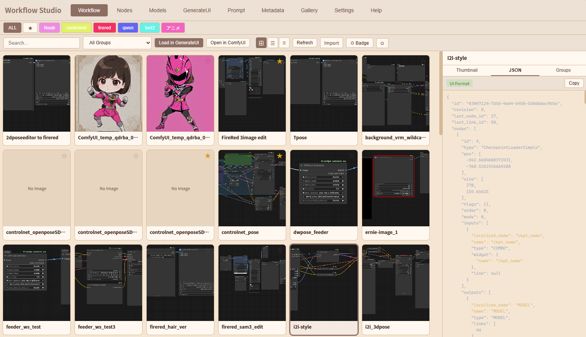 | 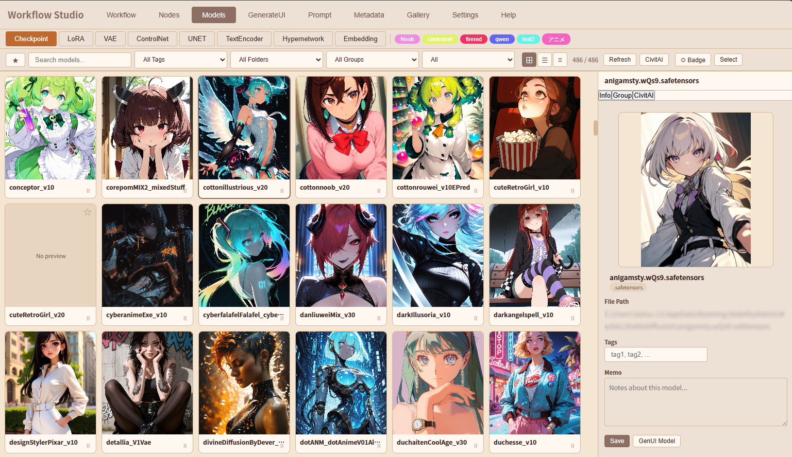 |

|                   Prompt Input Assistance                   |               Gen UI Feeder               |
| :----------------------------------------------------------: | :---------------------------------------: |
| 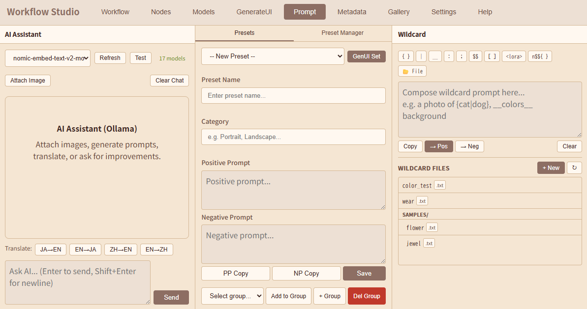 | 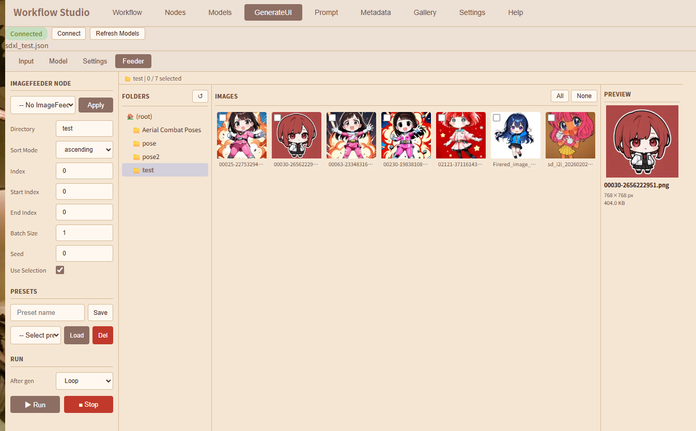 |

|                GenUI LoRA Stack                |               GenUI Batch               |
| :---------------------------------------------: | :-------------------------------------: |
| 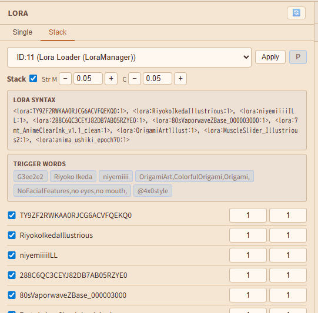 | 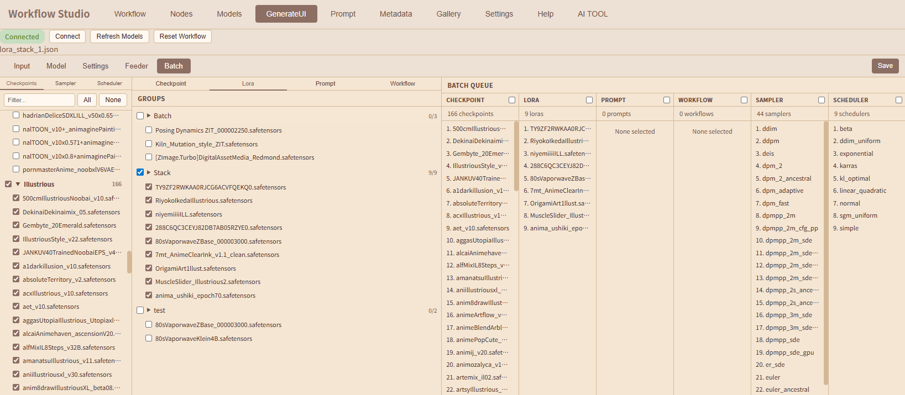 |

|                   Models Multi-select Menu                   |            Top Bar            |
| :-----------------------------------------------------------: | :---------------------------: |
| 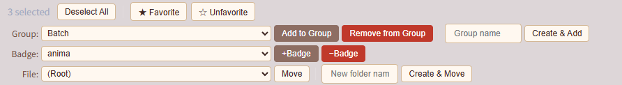 | 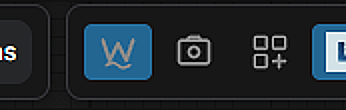 |

|              WS Library              |                  Library Information                  |
| :----------------------------------: | :---------------------------------------------------: |
| 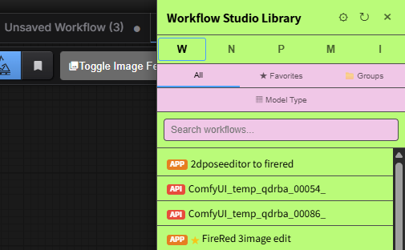 | 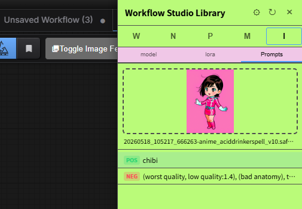 |

|            Tagger Tab            |              Image Edit Tab              |
| :-------------------------------: | :--------------------------------------: |
| 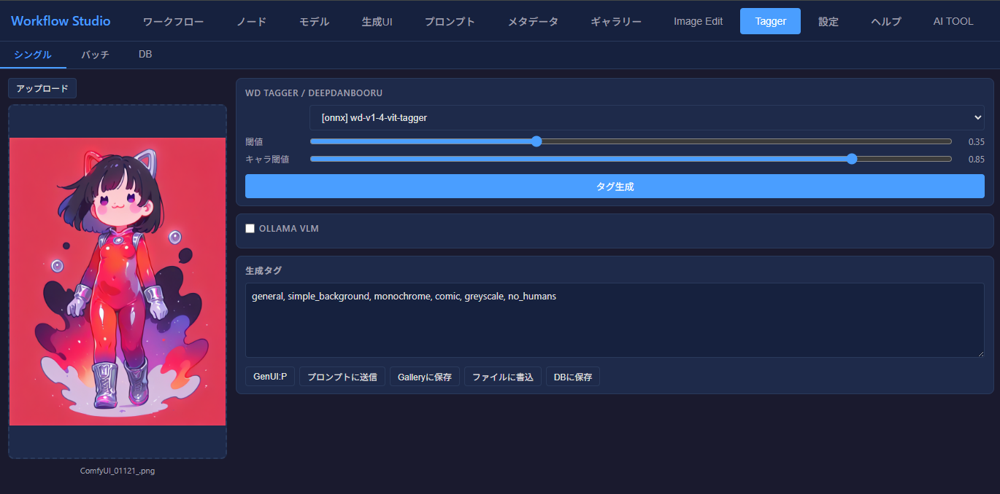 | 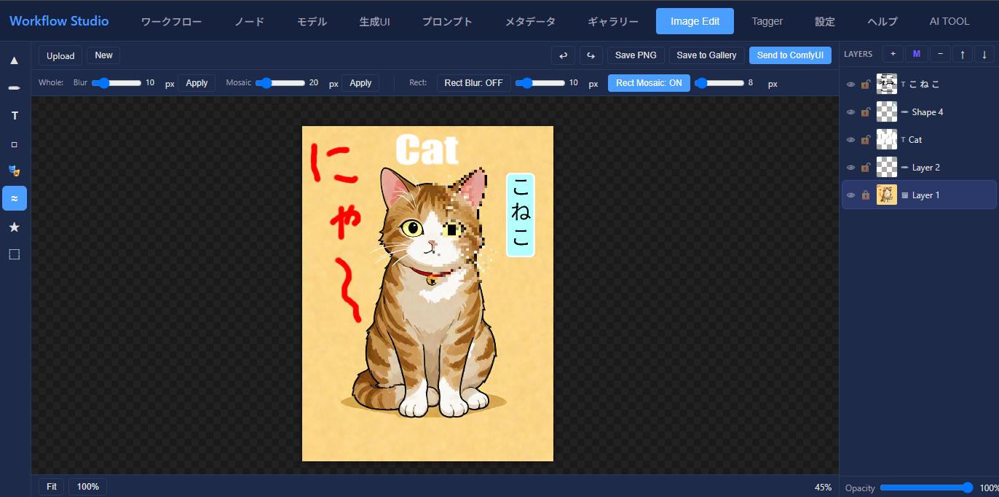 |

|             Customize             |  |
| :--------------------------------: | :-: |
| 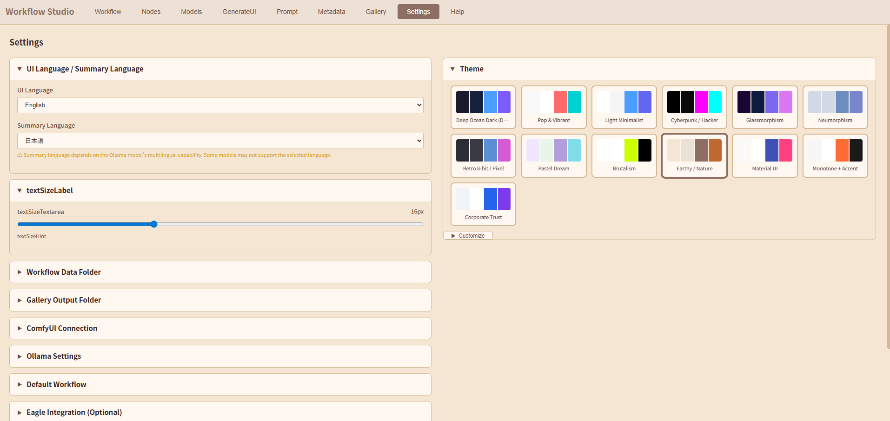 |  |

---

## Features

<details>
<summary><h3>Workflow Tab</h3></summary>

- **Thumbnail / Table views** — switch between view modes to browse your workflow library
- **Thumbnail side panel** — preview workflow canvas snapshots in the side panel
- **Badge filtering** — filter by user-defined badges (free labels you assign to each workflow)
- **Search** — full-text search across workflow names and metadata
- **Side panel tabs** — Thumbnail preview, JSON viewer with syntax highlighting, and Group management
- **Badge management** — add, rename, delete badges with custom colors shared with the Models tab (⚙ Badge button)
- **AI summary** — generate workflow descriptions using Ollama
- **Import / Export** — import workflows from files or clipboard; **Send to Canvas** button sends the selected workflow directly to the ComfyUI canvas (UI and API formats both supported)
- **Default view setting** — persist your preferred view mode (Thumbnail / Table)
- **Search clear (✕)** — inline ✕ button appears inside the search box whenever text is entered; click to clear immediately
- **Clear all filters (✕ Clear)** — rightmost toolbar button; resets search text, group filter, and badge filter (ALL) in one click

</details>

<details>
<summary><h3>Canvas Snapshot (v0.1.2)</h3></summary>

- **One-click capture** — click the camera button in ComfyUI's top bar to snapshot the current workflow canvas
- **Auto-save as thumbnail** — the snapshot is saved directly to the workflow data folder as a PNG thumbnail
- **Embedded workflow metadata** — workflow JSON is embedded in the PNG (tEXt chunk), compatible with ComfyUI's drag-and-drop import
- **Auto-import** — the captured workflow is automatically imported and appears in the Workflow tab

</details>

<details>
<summary><h3>GenerateUI Tab (v0.3.5)</h3></summary>

- **6-tab layout** — Input / Model / Settings / Feeder / Batch / **Lab** tabs; Input, Model, and Settings each include a Raw JSON column on the right for instant preview and direct editing
- **Save button** — located at the right end of the subtab row; opens a filename dialog (default: current workflow name) and saves the current workflow as a `.json` file to the Workflow tab via the import API
- **Input tab** — Prompt and Image inner tabs (drag-and-drop upload); Prompt tab shows Positive Prompt and Negative Prompt textareas, plus an **Embeddings selector** at the bottom (Filter + Select + Weight input + Paste button); Paste inserts `(embedding:Name:weight)` at the cursor position of the last focused textarea (defaults to Positive when neither is focused); Raw JSON (540px) in the right column
  - **Revert button** (v0.3.70) — a ↺ button next to each Apply button reverts the textarea to the node's currently applied value (the reverse of Apply)
  - **Emphasis weight editing** (v0.3.70) — select text (or just place the cursor on a word/parenthesis block) and press Ctrl+↑/↓ to adjust `(text:weight)` by ±0.05, A1111/native-ComfyUI style; parentheses are removed automatically when the weight returns to 1.0
  - **Mask slot for inpainting** (v0.3.71) — LoadImage slots whose MASK output feeds an inpaint node (e.g. `VAEEncodeForInpaint`) show an additional Mask drop zone; when a mask is set, image + mask are composited into a single RGBA upload (mask baked into the alpha channel) matching ComfyUI's native alpha→MASK extraction — no extra nodes required
  - **Placeholder Image + Clear** (v0.3.97) — each LoadImage card gets a **Clear** button (resets that card's pending selection/preview back to empty; doesn't touch the workflow node itself) and a **Placeholder** button; a collapsible **Placeholder Image** section (collapsed by default) at the top of the Image sub-panel configures one shared default — **Color** mode (set Width/Height/Color, generates a solid-color PNG on the fly) or **Image** mode (drop one default image, reused as-is) — remembered across sessions; clicking a card's own Placeholder button immediately replaces just that card's image with the configured default, so multiple LoadImage cards can each be replaced individually with one click
- **Model tab** — Checkpoint, VAE, Diffusion Model (UNETLoader / UnetLoaderGGUF / LoaderGGUF), and Text Encoder (CLIPLoader / DualCLIPLoader / ClipLoaderGGUF / DualClipLoaderGGUF — single clip: type + device; dual clip: two clip selectors + type + device) are always shown; **ControlNet** and **Hypernetwork** (with Strength field) are collapsed by default (v0.3.98) since they're used less often — click their header to expand; **LoRA** (Single/Stack tabs) has its own column; all selectors have a filter; Raw JSON on the right
  - **Highlight color** (v0.3.98) — the label of each model type above, plus the LoRA column header, turns a distinct color (default bright green, customizable in the Settings tab) when the loaded workflow actually contains that type of node; stays visible even while ControlNet/Hypernetwork are collapsed, so relevance is visible without expanding
  - **LoRA Stack Group toggle** (v0.3.92) — for `Lora Loader (LoraManager)` nodes, a **Use Stack Group** checkbox next to the Single/Stack tabs switches what the Stack tab shows and edits: OFF (the default whenever a workflow is loaded) displays and edits the LoRAs actually configured in the workflow's own Lora Manager node — correctly showing every LoRA it holds, not just the first one; ON switches to the LoRA group registered in the Models tab instead; toggling either direction clears the node's LoRA list first, then loads it from the newly selected source, and switching back to OFF restores exactly the list that was present when the workflow was loaded
  - **LoRA Bypass button** (v0.4.4) — a ⛔ toggle next to the Refresh Stack group button in the LoRA column header; forces the target LoRA node's strength to 0 (`strength_model`/`strength_clip` for a standard LoraLoader, or every entry's `strength`/`clipStrength` for a Lora Manager node — its LoRA list stays intact, not replaced) without touching the actual ComfyUI node's mode; click again to restore the exact values that were there before toggling; targets whichever node Single/Stack Apply default to (the workflow's Lora Manager node if it has one, else the first LoRA node); clicking a Single or Stack Apply button clears the bypass state so it can't silently reassert itself later
- **Settings tab** — KSampler and Latent Image side by side at 50% width each; Raw JSON on the right
- **Always-visible Raw JSON** — edit the API-format JSON directly from any tab with syntax highlighting; Apply button reloads the workflow; built-in **search bar** (always shown) finds all matches as you type with count display (`3/12`); navigate with ↑/↓ buttons or Enter / Shift+Enter; Escape or ✕ clears; current match highlighted in orange, other matches in yellow
- **Bypass/Mute node handling** (v0.3.75) — loading a UI-format workflow with Bypass-mode nodes now reroutes their wires to the upstream source (matching same-type input/output slots, recursively through chained bypasses) instead of leaving a dangling reference that failed validation; Mute-mode nodes are excluded without rerouting, same as ComfyUI itself; when either is present, a note listing the affected nodes appears above the Raw JSON search bar in the Input/Model/Settings tabs
- **One-click generation** — queue prompts to ComfyUI without leaving the studio
- **Seed control** — randomize, lock, or manually set seeds; seed input and mode selector stacked vertically for readability
- **Style selector** — checkbox and dropdown next to the Reset Workflow button; enable to apply a Fooocus-style JSON to positive and negative prompts at generation time; style files (`*.json`) are loaded from `user/default/Workflow-Studio/style/`; the style's `{prompt}` placeholder is replaced with the original prompt text, or the style is appended if no placeholder exists; `negative_prompt` is appended to the existing negative prompt; styles are applied to a per-generation copy and do not modify the loaded workflow
- **Create Catalog / Catalog buttons** (v0.3.95) — next to the Style dropdown. **Create Catalog** generates one preview image per Style checked in the Batch tab's Style sub-tab (using the currently loaded workflow, typically T2I), then saves each result into a chosen `ws_style_catalog` subfolder named after the Style (existing files with the same name are overwritten); a modal lets you create a new destination folder or pick an existing one — separate folders are useful for grouping catalogs by checkpoint or by purpose. **Catalog** jumps straight to the Gallery tab's Style_Catalog sub-tab to browse the results (see below)
  - **Don't keep a copy in the Output folder** (v0.3.96) — checkbox in the Create Catalog modal; each generation still writes a normal file to the Output folder first (the workflow's own Save Image node always does that), but once its copy has been saved into the catalog folder, checking this deletes that Output-folder original right away — keeps a large catalog run (e.g. every Style at once) from flooding the Output folder with near-duplicate files; if a style's catalog copy fails to save, its Output file is left alone rather than deleted
- **Batch type selector** — check one of the column header checkboxes in the Batch Queue pane (Checkpoint / Lora / Prompt / Workflow / Sampler / Scheduler / Style) to activate that batch type; only one type can be active at a time; the Batch panel below Generate shows the active type, progress, and Pause/Resume/Stop controls
- **Batch tab** (v0.3.18) — dedicated 3-pane layout for assembling the batch queue:
  - **Left pane** — 4 tabs: **Checkpoints** (file-tree; Filter / All / None), **Sampler** (KSampler sampler list), **Scheduler** (KSampler scheduler list), **Style** (flat list of all styles from `Workflow-Studio/style/`; All / None buttons)
  - **Center pane** — group-based selection with inner tabs (Checkpoint | Lora | Prompt | Workflow); Checkpoint/Lora groups come from the Models tab, Prompt groups from the Prompt tab, Workflow groups from the Workflow tab — check a group to add all its members, expand ▶ to select individually
  - **Right pane (Batch Queue)** — 7 columns: Checkpoint / Lora / Prompt / Workflow / Sampler / Scheduler / **Style**; each column header has an enable checkbox (radio behavior: only one at a time); count shown per column; Style batch applies each selected style sequentially to a workflow copy
  - **Lora batch prompt sync** (v0.3.69) — for each selected LoRA, its syntax (`<lora:name:strength_model:strength_clip>`) and CivitAI trained words are automatically appended to the Positive prompt (rebuilt from the original prompt each time, not accumulated), then restored to the pre-batch state when the batch completes or is stopped; if a selected LoRA is not yet recognized by ComfyUI's model list, a warning toast suggests a Refresh or restart
- **UI-to-API conversion** — automatic conversion supporting subgraphs (nested workflows), COMBO types, and display-only node exclusion; improved analysis covers SDXL multi-hop CONDITIONING chains, CLIPTextEncodeSDXL, SDXLPromptStyler, KSamplerAdvanced, and Guider-based "Advanced Sampling" workflows (`SamplerCustomAdvanced`/`SamplerCustom` + `CFGGuider`/`DualCFGGuider`/`BasicGuider` + `RandomNoise` + `KSamplerSelect` + `*Scheduler` — Flux.2 Klein, LongCat, Boogu, HiDream E1, etc.)
- **Eagle integration** — auto-save generated images to [Eagle](https://eagle.cool/) with metadata

</details>

<details>
<summary><h3>Feeder subtab (v0.3.5 / v0.3.42)</h3></summary>

Two independent modes selectable via **[Image Loop] / [Gallery]** toggle buttons at the top of the left pane (persisted in `localStorage`).

**Image Loop mode** — requires the **[comfyui-image-feeder](https://github.com/ketle-man/comfyui-image-feeder)** custom node.

- **ImageFeeder node control** — select the target node from a dropdown auto-populated from the loaded workflow; edit all node parameters (Directory, Sort Mode, Index, Start/End Index, Batch Size, Seed, Use Selection) and Apply to the workflow
- **Image library** — 3-pane layout: folder tree (left) browsing `user/default/image-loop-data/`, image grid with checkbox selection (center), preview panel with resolution and file size (right)
- **Selection management** — check individual images; All / None buttons for the current folder; selected files are reflected in `selected_files` on Apply
- **Presets** — save the current directory + selection as a named preset; load or delete presets (server-side persistence via `image-feeder-presets.json`)
- **Continuous Run loop** — Run / Stop buttons below the presets; **After gen** mode controls index behavior after each generation:
  - **Loop** — advance index and wrap back to 0 when all images are exhausted (runs indefinitely)
  - **Increment** — advance index and auto-stop when all images are consumed
  - **Fixed** — always use the same index
- **Index sync** — after each generation the node returns `next_index` via WebSocket (`image_loop_node_sync`); the Index field updates automatically
- **Seed** — Run loop uses the right-pane seed setting (Random / Fixed / Increment / Decrement); the node's own Seed field only affects random sort order

**Gallery mode** (v0.3.42) — no external plugin required; uses the built-in **WFS_GalleryFeeder** custom node.

- **WFS_GalleryFeeder node** — reads images directly from a Gallery group and outputs them one at a time; inputs: `group_name`, `index`, `sort_mode` (filename_asc / filename_desc / random), `seed`
- **Node & group selector** — pick the WFS_GalleryFeeder node from the loaded workflow and choose which Gallery group to feed images from; `__Feeder__` group is auto-created on first open
- **Image grid** — center pane shows all images in the selected group; click any image to update the Index to that position
- **After Gen modes** — Loop (wrap at end and continue indefinitely), Increment (stop automatically when last image is reached), Fixed (always use the same index)
- **Run / Stop controls** — left pane Run / Stop buttons manage the generation loop; After Gen combo (loop / increment / fixed), ▶ Run, and ■ Stop widgets are also available directly on the WFS_GalleryFeeder node in the ComfyUI canvas (`gallery_feeder_extension.js`)

</details>

<details>
<summary><h3>Lab subtab (v0.3.87 – v0.4.4)</h3></summary>

An experimental batch generator: runs the workflow currently loaded in GenerateUI N times, letting Model (Checkpoint/LoRA Single/VAE) / Prompt / KSampler each change independently starting at a chosen iteration — unlike the Batch tab's single-axis queue, every column keeps its own list of change points. Never mutates the loaded workflow; every iteration runs on a fresh clone. Works with both I2I and T2I workflows (v0.3.90).

- **Setting / Results / Plan JSON sub-panels** — Setting: image drop zone + 3 keyframe columns + run controls; Results: source image and up to 9 generated thumbnails (click to enlarge); Plan JSON: the current plan as raw editable JSON (v0.3.88)
- **Per-column keyframes** — Checkpoint, LoRA, VAE, Prompt, and KSampler each hold their own fully independent list of `{iteration, value}` keyframes; +/− per column adds/removes the last keyframe (iteration #1 is fixed and can't be removed); any keyframe other than #1 can also be deleted individually from inside its own edit modal (v0.3.93), not just the last one; click a cell to edit its value, the iteration it starts applying from, and a "revert to #1's setting" checkbox; the effective value at iteration N is the latest keyframe with iteration ≤ N, carried forward until the next one changes it; lowering the Batch count below an existing keyframe's iteration doesn't delete or renumber it — a warning toast appears and it just stays dormant until Batch count is raised again (v0.3.93)
- **Model column — Checkpoint / LoRA Single / VAE** (v0.4.2, redesigned v0.4.3) — Checkpoint and VAE (and now LoRA) share one visual "Model" column; a `[C][L][V]` toggle in its header picks which of the three independent keyframe lists the shared cell list, its own +/-, and its edit modal currently operate on — each behaves exactly like its own column (same as Prompt/KSampler), just sharing the Model column's screen space, so adding, removing, editing, reverting, or bypassing a keyframe while viewing one never touches the other two. Each toggle button lights up the same highlight color as GenerateUI's Model tab (configurable in Settings) when the loaded workflow actually contains that node type. A field left blank in a later keyframe's edit modal shows "(inherits: ...)" instead of "(workflow default)" when an earlier keyframe in that same list already set something. LoRA support is Single only (no Stack, matching the experimental scope of this tab); if a LoRA is set but the loaded workflow has no LoRA node at all, Run warns once and skips it rather than auto-inserting one — unlike VAE (which does auto-inject a VAELoader when missing), wiring in a LoraLoader would require rewiring the Checkpoint's model/clip outputs through it
- **Wildcards** (v0.3.93) — Prompt keyframes' Positive/Negative text supports the same A1111-style `__name__` syntax as the main GenerateUI prompt fields; each keyframe is expanded fresh right before that iteration runs, so reusing the same keyframe across iterations can still draw a different random line each time
- **Prompt cell extras** (v0.3.88, refined in v0.3.89, v0.3.93, and v0.3.97) — **Get from GenerateUI** fills Positive/Negative from the workflow currently loaded in GenerateUI; **Get from Image** extracts a prompt from the image currently loaded in Lab's own Image drop zone (same detection as the Metadata tab; no separate file picker); **Get from Previous** (v0.3.97) copies both Positive and Negative wholesale from the keyframe immediately before this one in the same column (e.g. editing #3 copies #2's prompt; not shown on keyframe #1, which has no earlier row); **Clear** (v0.3.97) empties both fields; **Style** row — an **Apply** button merges whichever style is currently selected in GenerateUI's own top-bar Style dropdown into the Positive/Negative text below, comma-separated after any existing text (never clears it) and works regardless of that top-bar's own Style enable checkbox; a checkbox next to it tracks on/off and shows the applied style's name beside itself (not on the button) — unchecking only clears that name label, the already-merged text stays and is yours to edit/delete by hand
- **Keyframe #1 live-reflect** (v0.3.97) — in every column, keyframe #1 shows the currently loaded workflow's own live setting instead of a blank placeholder — for the Model column this covers Checkpoint and VAE only, LoRA is never live-reflected since there's no reliable way to infer "the" active LoRA back out of a workflow node — both in its grid cell (dashed border) and pre-filled into its edit modal, for as long as it hasn't been explicitly saved with an override; saving it — even unchanged — locks that value in as a real override and the dashed/live styling goes away; switching to the Lab subtab always refreshes this against whatever is currently loaded in GenerateUI
- **Bypass checkbox** (v0.3.97) — available on every keyframe including #1; skips that row entirely when picking which setting applies at a given iteration, as if it didn't exist, so whatever was active before it keeps running instead; Lab-internal only, never touches the actual ComfyUI node's mode; disables that row's value fields and its Revert checkbox while checked (mutually exclusive with Revert); the cell shows an amber "⏭ Bypassed" label, taking priority over both the Revert and live-reflect display
- **LoRA node bypass & prompt injection** (v0.4.4) — inside the LoRA keyframe's own edit modal, two checkboxes independent of the row-level Bypass above: **Bypass LoRA node** forces that keyframe's `strength_model`/`strength_clip` to 0 at apply-time — the behavioral equivalent of ComfyUI's node Bypass (mode:4), since the workflow used here is already API-format with no `mode` concept; **Apply LoRA syntax + trigger words to Positive prompt** appends `<lora:name:strengthModel:strengthClip>` plus that LoRA's cached CivitAI trigger words to the Positive prompt, comma-separated, at apply-time — the same format GenerateUI's own Model tab Apply button writes. Switching keyframes (a different LoRA, this checkbox turned off, or the row Bypassed) always strips exactly what the previous iteration injected before adding anything new, so a batch never accumulates every LoRA it has used; the prompt checkbox is disabled automatically while Bypass LoRA node is checked
- **T2I workflow support** (v0.3.90) — a **T2I workflow (no source image)** checkbox in the Image pane skips the source-image requirement and never touches a LoadImage node, so workflows with no image input (e.g. plain `EmptyLatentImage` txt2img) can also use the Model/Prompt/KSampler keyframes; the Image drop zone and "Use generated image for next" are greyed out (not cleared) while it's on; saved with the plan as `t2i_mode`
- **Use generated image for next** — optional checkbox that chains iterations: from iteration 2 onward the previous iteration's first output image is fed back in as the I2I source instead of the original dropped image, using ComfyUI's `"name [type]"` annotated-filename reference (no re-upload needed); disabled together with the Image drop zone in T2I mode
- **Workflow recall** (v0.3.90) — every saved plan records the filename of the workflow that was loaded in GenerateUI at save time (`workflow_filename` in the Plan JSON); after loading a plan, an **Open Workflow** button appears next to it — click to load that exact workflow file back into GenerateUI (asks for confirmation first, since it replaces whatever is currently loaded)
- **Plan files** — Plan Save (silently overwrites the loaded plan) / Save As (always asks for a new name) / Plan Clear; plans are stored as `ws_labplan_<name>.json` in `user/default/Workflow-Studio/lab_plan/` (the `ws_labplan_` prefix is added automatically, v0.3.90 — type just the plain name when prompted), alongside an auto-generated `ws_labplan_<name>.png` index image (a 3-per-row contact sheet of up to 9 result thumbnails)
- **Plan Load** — same drag-and-drop / click-to-browse drop zone as the Image slot; drop a plan's `.json` (read directly in the browser) or any of its index-image `.png`s — since v0.3.91 every index image carries the full plan embedded in it directly (see below), so it's read straight from the file with no server round-trip; older index images without that embedding fall back to fetching a same-named `.json` from the server
- **Plan JSON tab** (v0.3.88) — view/edit the current plan as raw JSON (same shape saved to disk); Refresh re-reads it from the Setting tab, Apply to Setting parses your edits and writes them back into the Setting tab's columns/note/batch/chain-image/source-image/results — the same effect as loading that JSON as a plan file, without saving it first
- **Save index image to Output on Run** (v0.3.90, on by default since v0.3.93) — checkbox in the run controls; when checked, every completed Run also builds the same contact-sheet index image used for Plan files and saves it directly into ComfyUI's own Output folder as `Lab_index_<counter>_.png` (auto-numbered like a normal generated image, right alongside the images that Run just generated); independent of Plan Save, which always writes its own copy next to the plan file regardless of this checkbox; saved with the plan as `save_index_on_run`
- **Index images are self-contained plan files** (v0.3.91) — every index-image PNG, whether from Plan Save/Save As or from Save index image to Output on Run, carries the entire plan embedded directly in the file as a PNG `wfm_lab_plan` chunk; this is what lets the Output-folder copy above work as a Plan Load source even though it has no matching `.json` anywhere
- **Eagle integration** — every image Lab generates is auto-saved to Eagle the same way as GenerateUI's own Generate button, if enabled in the Settings tab; the Output-folder index image above is included too (v0.3.90) once saved

</details>

<details>
<summary><h3>Prompt Tab</h3></summary>

- **3-column layout** — AI Assistant (left), Presets/Preset Manager tab-panel (center), Wildcard/Style support (right)
- **AI chat assistant** — powered by [Ollama](https://ollama.com/), generate and refine prompts interactively
- **Image attachment** — attach reference images for vision-capable models
- **Translation** — JA/EN/ZH translation buttons for multilingual prompt creation
- **Prompt presets** — save/load reusable prompt templates (positive & negative) with category support
- **Preset Manager** — browse all presets, favorites, and group-based filtering with search
- **Group management** — create groups, assign/remove presets, delete groups from the Presets panel
- **Clipboard copy** — copy positive/negative prompts individually (PP Copy / NP Copy)
- **GenUI Set** — apply preset prompts directly to the GenerateUI interface
- **Wildcard/Style tab bar** (v0.3.96) — the right pane switches between the wildcard tools below and a Style manager (same pane, two modes)
- **Wildcard input toolbar** — one-click buttons to insert `{|}`, `{n$|}`, `__|__`, `<lora::1:LBW=;>` and other wildcard syntax; wraps selected text when applicable
- **Wildcard file manager** — create, view, and edit `.txt` / `.yaml` wildcard files stored in `user/default/Workflow-Studio/wildcard/`; click a filename in the file picker to insert `__filename__` at cursor
- **Style manager** (v0.3.96) — create, edit, and delete registered Styles (the same ones used by GenerateUI's Style dropdown, the Batch tab, and the Style Catalog), using the same list→editor CRUD pattern as the Wildcard file manager above; each entry has a Name, a Positive prompt (supports the `{prompt}` placeholder, or appends if omitted), and an optional Negative prompt
  - **Source-file badge & in-place editing** — each list entry shows its defining file as a small badge next to its name (e.g. `sdxl_styles_diva.json`); renaming a style keeps its position in that same file rather than moving it; a name must be unique across all styles
  - **New styles go to a dedicated file** — created via **+ New**, a style is appended to its own `custom.json` inside the style folder, so the bundled style packs are never modified directly
  - **+ Add to this file** — while editing an existing style, this button clears the form for a brand-new entry that gets appended to that *same* file instead of the default `custom.json` — the way to add a style into one of the bundled packs
  - Saving, renaming, or deleting a style immediately refreshes GenerateUI's Style dropdown, the Batch tab's checklist, and the Style Catalog's name list — no reload needed

</details>

<details>
<summary><h3>Metadata Tab (v0.3.8)</h3></summary>

- **3-column layout** — Drop zone (left) | Model info (center) | LoRA + Prompt (right)
- **File drop** — drop a ComfyUI-generated PNG / WebP or workflow JSON onto the drop zone (or click to open a file picker); PNG/WebP images are shown as a preview
- **Model extraction** — automatically extracts Checkpoint, VAE, Diffusion Model, and Text Encoder names from the workflow; supports both standard and subgraph-based workflows (Flux.2 Dev/Klein, Qwen-Image-Edit/2511/Layered, Z-Image Base/Turbo, Ernie Image, WAN2.2, Mage-Flow, LongCat, Boogu, HiDream E1, FireRed, Krea-2 Turbo); node types covered: UNETLoader, UnetLoaderGGUF, UNETLoaderGGUF (e.g. HiDream GGUF), CLIPLoader, DualCLIPLoader, TripleCLIPLoader, QuadrupleCLIPLoader (e.g. HiDream 4-CLIP)
- **LoRA extraction** — lists all LoRA models with `strength_model / strength_clip` values
- **Prompt extraction** — lists prompts with POS / NEG badges when positive/negative can be determined; when distinction is not possible (e.g. `SamplerCustomAdvanced`, intermediate nodes, cross-level connections), prompts are shown without a badge as plain **Text**; click any entry to view the full text below
  - **CLIP Text Encode edit+ support** (v0.3.92) — `CLIPTextEncodeEditPlus` nodes are resolved using the same RAW / EDIT / front / back combination rule as the node itself, correctly merging the linked `text1` (e.g. a Lora Manager's trigger words) with the editable `text_edit` field instead of showing only one side
- **Prompt actions** — Copy to clipboard, **GenUI:P/N** (set GenerateUI positive/negative prompt), **Prompt:P/N** (set Prompt tab preset positive/negative)
- **Format support** — ComfyUI PNG/WebP/JSON (standard + Flux.2 / Qwen-Image / Z-Image / Ernie Image / WAN2.2 / Mage-Flow / LongCat / Boogu / HiDream E1 / FireRed / Krea-2 Turbo subgraph workflows), SD WebUI, SD Forge, Fooocus
- **Format note** — supported formats and covered model types are always shown in the left column

</details>

<details>
<summary><h3>Settings Tab</h3></summary>

- **2-column layout** — left column for all settings; right column shows the Theme panel fixed in place (sticky)
- **Collapsible sections** — all settings organized in accordion panels for a clean layout
- **Theme selection** — 13 built-in themes with visual swatch preview (Dark, Pop, Minimalist, Cyberpunk, Glassmorphism, Neumorphism, Retro Pixel, Pastel, Brutalism, Earthy, Material, Monotone, Corporate)
- **Theme customization** — override colors (background, surface, text, primary, accent), add background patterns (horizontal/vertical/diagonal stripes, polka dot, checkerboard, custom SVG tiling with color/opacity/scale/gap controls), and select from 16 fonts including Japanese display fonts (Google Fonts)
- **Workflows directory** — configure which folder to scan for workflows
- **Gallery output directory** — configure which output folder the Gallery tab scans for images
- **Eagle connection** — set Eagle API endpoint for auto-save
- **Ollama connection** — configure Ollama server URL
- **CivitAI Host** — choose which site opens when clicking a model link: `civitai.com` (SFW only) or `civitai.red` (unrestricted); saved to `settings.json` and synced to `localStorage` for the Models tab to use without extra fetches
- **CivitAI API Key** — optional Bearer token for authenticated CivitAI access; stored in `settings.json` (excluded from data exports); environment variable `CIVITAI_API_KEY` takes priority if set
- **Default workflow** — set a workflow to auto-load on startup
- **Default Checkpoint** (v0.3.73) — optional checkbox to force every checkpoint loader node's model to a chosen default whenever a workflow is loaded into GenerateUI; a safeguard against generation errors or garbled images from a stale/mismatched checkpoint saved in the workflow file
- **Data Management** — export all plugin data (settings, metadata, prompts, etc.) to a single JSON file; import to restore data (useful when migrating or reinstalling); API keys are excluded from exports for security
- **Text Size** — one slider (10–28 px) adjusts font size for all prompt and chat textareas at once: Generate UI positive/negative prompts, AI Assistant chat input, Preset prompts, Wildcard prompt and file editor, and Metadata prompt full preview; takes effect immediately and saved with Save Settings
- **RAW JSON Colors** — customize the 6 syntax highlight colors for the Raw JSON editor in Generate UI: Default Text (base), Name/Scheduler (yellow), Title (pink), Width/Height (green), Prompt/Text (cyan), Image/File (red); changes apply immediately on color pick; Reset Defaults restores the original scheme; saved to `localStorage` under `wfm_settings.jsonColors` and applied on startup
- **GenerateUI Model Tab Highlight** (v0.3.98) — pick the color used to mark Checkpoint/VAE/Diffusion Model/Text Encoder/ControlNet/Hypernetwork labels and the LoRA column header in GenerateUI's Model tab when the loaded workflow actually contains that type of node; default bright green; changes apply immediately, Reset Defaults restores it; saved to `localStorage` under `wfm_settings.modelTabActiveColor`
- **Wildcard Integration** — link the WFS wildcard directory to ComfyUI-Impact-Pack's `wildcards/` directory (directory junction on Windows, symlink on other OS); existing WFS wildcard files are automatically migrated; requires [ComfyUI-Impact-Pack](https://github.com/ltdrdata/ComfyUI-Impact-Pack)
- **G'MIC-Qt Integration** — set the path to `gmic_qt.exe` for the Image Edit Filter tool; download G'MIC-Qt Standalone from `gmic.eu/download.html` (Windows: `gmic_qt-win64.zip`), extract anywhere, then enter the full path to `gmic_qt.exe` and click Save
- **Language** — English / Japanese / Chinese

</details>

<details>
<summary><h3>Gallery Tab (v0.3.44)</h3></summary>

- **Output / Style-Prompt sub-tabs** (v0.3.94) — the Gallery tab has two sub-tabs at the top: **Output** (the image browser described below) and **Style/Prompt** (a separate visual prompt-building library — see its own section below)
- **Image browser** — browse ComfyUI output images (Thumbnail / Table views) with server-side scanning optimized for 6,000+ image libraries
- **Folder tree root label** (v0.3.90) — the root entry in the folder tree is labeled simply **[root]**, no longer suffixed with the scanned folder's own directory name (which could be a misleading, environment-specific name — e.g. StabilityMatrix installs where the output folder is a symlink named `Text2Img` — even though the folder holds every kind of generated output, not just text-to-image results)
- **Thumbnail / Table views** — switch view modes; Favorites column shown leftmost in Table view
- **Folder management** — create subfolders ("+ New") or delete the selected folder with all contents ("Del") from the folder tree header
- **File operations** — move or delete individual images from the detail panel's Info tab; bulk Move To..., Export, and Delete File from the multi-select bar
- **Download** — hover over the image preview in the detail panel to reveal a download icon (⬇); click to download the single image
- **Multi-select** — Ctrl+click to select multiple images; Bulk Bar appears for batch operations: select group → "Add to Group" / "Remove from Group"; Favorite All / Unfavorite All; Compare (2–4 images); Move To...; **Export** (downloads all selected images as a ZIP file); Delete File
- **Image Compare** — select 2–4 images with Ctrl+click, then click "Compare" in the Bulk Bar to open a side-by-side lightbox; grid adapts to the number of selected images
- **Prompt search** — text search covers filename, tags, memo, and prompt text (A1111 `parameters` field cached on first detail panel open)
- **Server-side filtering** — filter by group, favorites, or tags with fast server-side set lookup (no full rescan)
- **Group management** — create, rename, delete groups and assign/remove images using the same 4-section panel as Models tab; **`__Feeder__`** is a reserved group (🔒 prefix) that cannot be renamed or deleted; used by the Feeder Gallery mode to define the generation queue; **FC** button in the toolbar clears all members without deleting the group
- **Thumbnail F button** — cyan overlay button (top-left of each image card) toggles the image's membership in the `__Feeder__` group; cyan and always-visible when the image is in the group; visible on hover only when inactive
- **Favorites** — star images inline without reopening the detail panel
- **Detail panel** — view filename, path, tags, groups, and metadata in a slide-out panel
- **Workflow viewer** — Metadata tab displays workflow JSON from PNG embedded data (`prompt` / `workflow` keys) or from workflow saved by the Generate UI tab; **Copy & Send Canvas** button copies the JSON to the clipboard and sends the workflow directly to the ComfyUI canvas (UI and API formats both supported)
- **Load GenUI button** — loads the embedded ComfyUI workflow from the selected image directly into the GenerateUI tab; shows a warning toast if no workflow is embedded or the format is unsupported; Metadata button is styled green, Load GenUI button uses the primary accent color
- **Image Edit button** — toolbar button; sends the selected image directly to the Image Edit tab as the base layer
- **Send GenUI Image button** — toolbar button (next to Image Edit); uploads the selected image to ComfyUI and sets it as the input for the first LoadImage node in the GenerateUI tab; automatically switches to GenerateUI → Input → Image; requires a workflow with at least one LoadImage node to be loaded
- **Send CC button** (v0.3.69) — toolbar button, shown only when this Gallery tab is embedded as an iframe inside ComfyUI Comic Creator (a separate custom node); sends the selected image directly into Comic Creator's currently selected panel/overlay
- **Search clear (✕)** — inline ✕ button appears inside the search box whenever text is entered; click to clear immediately
- **Clear all filters (✕ Clear)** — rightmost toolbar button; resets search text, tag filter, group filter, and favorites filter in one click (sort order is preserved)
- **Workflow auto-save** — images generated from the Generate UI tab have their workflow automatically saved to gallery metadata
- **Output folder configurable** — set the scanned output folder from Settings tab
- **SVG file support** (v0.3.77) — `.svg` files are browsable, previewable (detail panel and lightbox), and included in favorites/tags/groups/move/delete/export alongside raster formats; served as-is with no rasterized thumbnail, since `` scales vector graphics natively at any size
- **Performance** — server-side 256px JPEG thumbnail generation with disk cache (`data/thumb_cache/`); infinite-scroll paging (50 images per page, IntersectionObserver); folder-level mtime cache (60s TTL); bulk operations use single-request API endpoints

</details>

<details>
<summary><h3>ImagePrompt Gallery subtab (v0.3.94, renamed from Style/Prompt in v0.3.95)</h3></summary>

- **Visual prompt library** — a Gallery sub-tab for browsing reference images and building prompts from them visually, separate from the Output browser; manages a dedicated `ws_image_prompt` folder, created automatically inside the ComfyUI output directory
- **3-column layout** — folder tree (left) | thumbnail grid (center) | prompt builder (right); selecting any folder (including a parent category folder) recursively shows every image in its subfolders too, both in the grid and in the tree's count badges
- **Prompt builder (right pane)** — clicking a thumbnail previews it and its prompt text without adding it yet; **+ Add** appends it as a removable chip under "Selected Prompts" (**Clear All** to reset); **Save** edits and persists the prompt text for that image; **Final Prompt** combines all chips into one comma-separated, freely-editable text; **Copy** sends it to the clipboard
- **Plain-text prompt storage** — each image's prompt lives in a `.txt` sidecar file next to it (same base name, no database) — anyone can add their own entries by dropping an image + matching `.txt` file into a subfolder; the Output Gallery's own detail panel reads and displays the same file when browsing into `ws_image_prompt`
- **ponyxlWildcardsVault format support** — if no `.txt` sidecar exists, prompts are resolved on the fly from a `*.yaml` + `thumbnails/` (also `thumbnails_option2/`) pack placed directly under the folder, using the same key/tag structure as Navimixu's [PonyXL Wildcards Vault](https://civitai.com/models/615967/ponyxl-wildcards-vault) packs — just drop the downloaded pack folder in, no import step required
- **Seed data importer** — `tools/import_style_prompt_seed.py` (dev tool, ships no image data) pre-processes a wildcards-vault-style source folder into portable image + `.txt` pairs under `ws_image_prompt`, for archiving a stable, portable copy instead of relying on the on-the-fly YAML fallback

</details>

<details>
<summary><h3>Style_Catalog Gallery subtab (v0.3.95)</h3></summary>

- **Visual Style picker** — a third Gallery sub-tab for picking a registered GenerateUI Style (`user/default/Workflow-Studio/style/*.json`) by its preview image instead of its name in a dropdown; manages a dedicated `ws_style_catalog` folder, created automatically inside the ComfyUI output directory; populated by GenerateUI's **Create Catalog** button (see GenerateUI Tab above)
- **3-column layout** — folder tree (left) | thumbnail grid (center) | Positive/Negative prompt panel (right); like ImagePrompt, selecting a parent folder recursively shows every image in its subfolders
- **Positive/Negative panel** — clicking a thumbnail reads the Positive/Negative prompt actually embedded in that generated image (reusing the Metadata tab's extraction logic — no separate metadata store), each with its own **Copy** button
- **Select as Style button** — matches the selected image's filename (without extension) against a registered Style name and switches the GenerateUI tab's Style dropdown to it; a visual shortcut into the existing named-Style system, not a one-off apply of the embedded prompt — if the Style was renamed or deleted since the catalog image was created, a "no matching style" toast is shown instead
- **Load in GenerateUI / Open in Metadata Tab buttons** (v0.3.96) — read the workflow embedded in the catalog image itself (a byte-identical copy of the original output image, so it carries the same PNG metadata) and either load it straight into the GenerateUI editor or open the image in the Metadata tab — no need to hunt down the original file in the Output folder, and works even on catalog images created before this feature existed
- **Double-click to enlarge** (v0.3.96) — double-click a thumbnail in the center grid, or the selected-image preview in the right panel, for the same full-size lightbox view as the Output Gallery

</details>

<details>
<summary><h3>Nodes Tab (v0.1.7)</h3></summary>

- **Node Browser** — browse all installed ComfyUI nodes from `/object_info` API with Card/Table views
- **Search & Filter** — full-text search, filter by category, package, tags, groups, and favorites
- **Package badges** — color-coded badges generated from package names
- **Node detail panel** — view I/O specifications, edit tags, manage groups
- **Node Sets** — save multiple nodes + connections as reusable sets from the ComfyUI canvas
- **Right-click context menu** — "Save as Node Set" option on any node in ComfyUI
- **Multi-select** — Ctrl+click to toggle individual nodes, Shift+click for range selection; bulk action bar appears with: add to group / remove from group / create & add group / bulk favorite / unfavorite
- **Search clear (✕)** — inline ✕ button appears inside the search box whenever text is entered; click to clear immediately
- **Clear all filters (✕ Clear)** — rightmost toolbar button; resets search text, category, package, tag, group, and favorites filter in one click

</details>

<details>
<summary><h3>Models Tab (v0.2.3)</h3></summary>

- **Model Browser** — browse all installed ComfyUI models (Checkpoint, LoRA, VAE, ControlNet, UNET, TextEncoder, Hypernetwork, Embedding) with sub-tab switching
- **Thumbnail / Table views** — switch between view modes with pagination (24 items per page); Table view includes **Type** and **Base Model** columns sourced from cached CivitAI data, displayed between the Subdirectory and Extension columns; Enable/Disable column labeled **E/D**
- **Table column sort** — click any column header to sort ascending (▲), click again for descending (▼), click a third time to clear; active column highlighted in accent color
- **Search & Filter** — full-text search, filter by tags, groups, and favorites
- **User-defined badges** — assign free-label badges to models; badge colors shared with the Workflow tab palette
- **Side panel tabs** — opens to CivitAI tab by default when a model is selected; Info (file path display with click-to-copy, tags, memo), Groups management, CivitAI integration
- **CivitAI integration** — fetch model metadata by SHA256 hash; side panel shows **Type** (badge), **Base Model**, **Hash** (BLAKE3/SHA256, click to copy), trained words, tags, and model page link; model link opens in the site selected in Settings (civitai.com or civitai.red)
- **CivitAI panel — Info / Sample sub-tabs** — Info tab shows model details (name, type, base model, hash, trigger words, tags, description); Sample tab shows all sample images (count shown in tab label); clicking any image opens the full-size version in a new tab
- **CivitAI panel states** — three distinct states: not yet checked (fetch button), checked but not found on CivitAI (re-check button with notice), and found (full info display); clicking the CivitAI tab always refreshes to the latest state
- **Batch CivitAI fetch** — one-click batch fetch using `POST /model-versions/by-hash` (up to 100 models per request) with SSE progress streaming; previews are auto-saved for models without one
- **Detail modal** — preview image, CivitAI info, thumbnail change via file upload; **Delete** button permanently removes the model file and all associated sidecar files (preview images, `.json`, `.civitai.info`, `.metadata.json`, `.cm-info.json`)
- **GenUI Model button** — apply the selected model directly to the corresponding node in GenerateUI's current workflow (Checkpoint, LoRA, VAE, ControlNet, UNET, TextEncoder, Hypernetwork); **Embedding** type shows **GenUI PP** / **GenUI NP** buttons instead — appends `(embedding:Name:1.0)` to the Positive or Negative prompt of the loaded workflow; also accessible from the side panel nav bar and the detail modal
- **Group management** — create, rename, delete groups and assign/remove models; groups are scoped per model type (checkpoint groups only appear in the Checkpoint tab); Checkpoint and LoRA tabs include **B (Batch)** and **S (Stack)** quick-assign buttons per card/row for one-click group membership toggle without grid re-render
- **Table view memo** — memo column displayed in table view for quick reference
- **Preview images** — auto-detect `{model_stem}.preview.png` next to model files
- **Enable / Disable models** — hide models from ComfyUI by renaming the file extension (`.disabled` suffix); toggle per card (⏸ button), per group (Enable All / Disable All), or filter by status (All / Enabled / Disabled)
- **Multi-select & bulk operations** — click the green **Select** button to enter selection mode and check multiple models; the bulk action bar is organized in three rows:
  - **Group row** — select an existing group and **Add** / **Remove**, or type a new name and **Create & Add**
  - **Badge row** — select a badge and **+Badge** / **−Badge** to apply or remove from all selected
  - **File row** — select a destination subfolder (or type a new folder name and create it) then **Move** to relocate the model file with all sidecar files; **Delete Files** (right end) permanently removes selected models and all associated files
- **Search clear (✕)** — inline ✕ button appears inside the search box whenever text is entered; click to clear immediately
- **Clear all filters (✕ Clear)** — rightmost toolbar button; resets search text, tag filter, folder filter, group filter, favorites filter, and status filter in one click

</details>

<details>
<summary><h3>Tagger Tab (v0.3.38)</h3></summary>

- **3 sub-tabs** — Single / Batch / DB for single-image tagging, folder batch processing, and tag database management
- **Model support** — WD Tagger (ONNX, NCHW/NHWC auto-detect), SwinV2 (ONNX), DeepDanbooru (.h5, requires TensorFlow); place each model in its own subfolder under `ComfyUI/models/tagger/<model-name>/` containing the `.onnx` + `selected_tags.csv` (or `.h5` + label file)
- **Threshold sliders** — General threshold (default 0.35) and Character threshold for `character:` prefix tags (default 0.85); sliders update the display value in real time
- **Ollama VLM** — optional vision model alongside WD Tagger; set API URL and select model (↻ to refresh list); results from both models are merged into one comma-separated tag string
- **Single tab** — drag & drop an image onto the preview area or click Upload; Gallery detail panel **Tagger** button opens the selected image directly here
- **Single output options** — (1) **GenUI:P** — appends tags to the GenerateUI tab's positive prompt and immediately applies to the loaded workflow; (2) **Send to Prompt** — appends tags to the Prompt tab's positive textarea; (3) **Save to Gallery** — saves tags to Gallery image metadata (requires image opened from Gallery); (4) **Write to File** — embeds tags into JPEG EXIF (`ImageDescription`) or PNG `tEXt` chunk (`Tags` key), other formats get a `.tags.json` sidecar; (5) **Save to DB** — stores in internal SQLite database
- **Batch tab** — enter a folder path, configure WD Tagger and Ollama settings; output options: **Save to DB** (default on), **Write to File** (EXIF/PNG metadata), **Write .txt** (creates `<filename>.txt` alongside each image with all tags); real-time progress bar and log; Stop cancels after the current image
- **DB tab** — searchable SQLite database of all tagged images; click a row to open the edit panel and modify WD Tags / VLM Tags; Save updates the record, Delete removes it; Export CSV downloads all records
- **Dependencies** — install into ComfyUI's embedded Python: `python_embedded\python.exe -m pip install -r requirements.txt`; for GPU inference use `onnxruntime-gpu`; TensorFlow (DeepDanbooru) is optional and commented out in `requirements.txt`

</details>

<details>
<summary><h3>Image Edit Tab (v0.3.65)</h3></summary>

- **Layer-based image editor** — compose images with multiple layers (Image, Text, Draw, Mask types) and export the composite as PNG
- **Loading images** — drag & drop onto the canvas, Upload button, or send from the Gallery tab via the **Image Edit** toolbar button; first image becomes Layer 1 (auto-locked), subsequent images are added as new layers scaled to fit the canvas
- **New button** — create a blank canvas with custom dimensions (WxH prompt); clears all existing layers and automatically adds an empty Layer 1 (v0.3.70)
- **Tools** — Select (V), Draw (B), Text (T), Shape (S), Mask (🎭), Blur (≈), BG Remove (⬚), Filter (★), Inpaint (🩹); tool options bar updates per active tool
  - **Select** — click to select; drag to move; drag corner handles to resize; drag circle handle to rotate; Flip H / Flip V / Rotate angle in the options bar; double-click a text layer to re-edit its content
  - **Draw** — freehand brush; options: color, brush size, blend mode; paints directly onto the active draw layer while all other layers remain visible; brush cursor shown as a size-accurate circle; strokes can start from outside the canvas margin and continue past the edge
  - **Text** — click to place; configure font, size, bold/italic, align, and color; placed as an exact-size text layer sized to the measured bounding box; double-click to re-edit
  - **Shape** — drag to draw geometric shapes (Rect / Ellipse / Line / FreeLine); options: shape type, Rounded toggle (Rect/Ellipse), Fill color, Stroke color + width, Opacity; each committed shape becomes an independent draw layer; Stroke None hidden for Line/FreeLine (stroke always active)
  - **Mask** — 7 sub-tools for painting masks onto a dedicated mask layer; click **M** in the Layers header to add a mask layer (Mask tool activates automatically); clicking a mask layer in the list also switches to the Mask tool; **Tool Options bar**: sub-tool buttons (Paint / Color / Alpha / Text / Vector / Shape / SAM3), Invert checkbox, Overlay color picker (default red), Blur slider (0–50 px); the overlay is only shown for the currently active mask layer, other mask layers stay hidden until selected (v0.3.70); SAM3 requires Mask Editor One (disabled when not installed); Color / Alpha / Text / Vector / Shape work without Mask Editor One; **Properties pane — Paint**: Mode (Add / Erase), Size (1–200 px), Hardness (0–100%); **MASK EDITOR ONE section** (Paint sub-tool, visible when installed): Select opens the ABR stamp-brush library; ✕ clears back to Circle; when an image brush is active, Hardness is disabled and Spacing (5–100%), Angle (0–359°), Sz Jitter (0–100%), Rot. Jitter (on/off) appear; **Edit in Mask Editor One →** (v0.4.0) — sends the current canvas composite (plus the active mask layer's content, if one is selected) to a MaskEditorOne node on the ComfyUI canvas — the currently selected node if it is one, otherwise the first MaskEditorOne node found in the graph (same selection logic as **Send to Workflow**) — and opens its full interactive editor (paint, SAM3, BiRefNet, shapes, etc.) in the ComfyUI browser tab; clicking Apply there imports the result back here as a new mask layer; requires Workflow Studio to have been launched from ComfyUI's top-menu button and at least one MaskEditorOne node to exist on the ComfyUI canvas; **Properties pane — Color**: click canvas to flood-select pixels by color similarity; Mode (Add / Subtract), Tolerance (0–255), Feather % (0–100); **Properties pane — Alpha**: extract the active layer's transparency as a mask; Threshold, Invert checkbox, Extract Alpha button; **Properties pane — Text**: click canvas to open a stamp overlay — enter text, set Font / Size / Bold / Italic / Align / Mode (Add / Erase), Stamp or Ctrl+Enter to apply; multi-line supported; **Properties pane — Vector**: click to add Catmull-Rom spline points; Enter (or click first point) closes and fills the polygon; Backspace removes the last point; Esc resets; Mode (Add / Erase); **Properties pane — Shape**: drag to draw Rect or Ellipse; hold Shift for square/circle; blue dashed outline preview while dragging; Mode (Add / Erase); **Properties pane — SAM3**: enter a text prompt, set Max candidates (3/6/9/12), click Segment; select candidate thumbnails (multi-select), Apply Selected (N) applies with current Mode; **Mask layer A/S operation**: A/S toggle — Add (green) composites normally, Subtract (red) cuts the mask from below; **✂ clipping mask button** clips the layer below to the painted area; brush cursor shown as size-accurate circle; strokes can start from outside the canvas margin and continue past the edge
  - **Blur** — **Whole Blur**: Gaussian blur to the entire active layer with intensity slider (1–50 px); **Whole Mosaic**: pixelation mosaic with block-size slider (5–100 px); **Rect Blur / Rect Mosaic**: enable the toggle then drag a rectangle on the canvas to apply blur or mosaic to that region only (blue preview for blur, orange for mosaic); Rect Blur and Rect Mosaic are mutually exclusive; all operations support Undo
  - **BG Remove** — remove the background from the active layer; **Lightweight (@imgly)**: runs entirely in the browser via CDN (no server required; ~40 MB model downloaded on first use); **BiRefNet**: high-quality removal via Mask Editor One's Python backend (requires Mask Editor One installed and `birefnet.safetensors` in `ComfyUI/models/background_removal/`); **New Layer** option (default on) adds the result as a new layer above the original; when off, replaces the active layer in-place
  - **Filter (G'MIC)** — apply G'MIC-Qt filter effects to the active image layer; click **Edit with G'MIC** to launch G'MIC-Qt GUI; select a filter and click OK — a "G'MIC-Qt filter output" window appears; close it to save the result back as the active layer; requires G'MIC-Qt Standalone installed and path configured in Settings → G'MIC-Qt Executable Path
  - **Inpaint** (v0.3.71) — composites the visible layers plus a Mask layer into one RGBA image (mask baked into the alpha channel) and applies it to the first inpaint-capable LoadImage node in the workflow currently loaded in GenerateUI (a node whose MASK output feeds something like `VAEEncodeForInpaint`); also supports workflows built around the **Mask Editor One** custom node (`comfyui-mask-editor-one`) instead of LoadImage — image/mask are pushed via its node_id-keyed server cache and `layer_data` widget; **Properties pane**: Positive/Negative prompts, Grow Mask By (applied to the VAE Encode (for Inpainting) node), Denoise (applied to KSampler), Run button; **Use dedicated workflow** checkbox — when off, generates against the workflow currently loaded in GenerateUI; when on, pick a saved workflow from the dropdown to load, edit, and generate entirely in the background without disturbing what's shown in GenerateUI; the result image is shown back in the Properties pane when generation completes; requires a Mask layer painted first (Mask tool)
- **Layer panel** — layer list with visibility (👁/🚫), lock (🔒/🔓), and clipping-mask (✂) toggles; opacity slider; type icons (🖼 image / T text / ✏ draw / ⬚ mask); Layer 1 is automatically locked on first image load
- **Layer lock** — locked layers show an orange bounding box and 🔒 icon on the canvas; move/resize/rotate are disabled while locked; click the 🔓 button in the layer row to unlock
- **Text quality** — text layers are rendered at their measured bounding-box size; resizing with the Select tool regenerates the canvas at the new display resolution so text stays sharp
- **Export** — Save PNG (download composite locally); **Save to Gallery** (saves to Gallery root folder with a timestamped default name `wfs-image-YYYYMMDDHHmmss`); **Save to Input** (uploads to ComfyUI input folder for use in Load Image nodes); **Send to Workflow** (v0.4.0) — uploads the same way, then writes the resulting filename directly into the `image` widget of the node currently selected on the ComfyUI canvas (falls back to the first LoadImage-type node found); requires Workflow Studio to have been launched from ComfyUI's top-menu button so the ComfyUI tab is reachable
- **Canvas navigation** — scroll-wheel zoom, Space + drag to pan; zoom indicator in the bottom bar
- **Undo / Redo** — Ctrl+Z / Ctrl+Y (or toolbar buttons); keyboard shortcuts: V (Select), B (Draw), T (Text), S (Shape), Delete (remove selected layer when 2+ exist)

</details>

<details>
<summary><h3>AI TOOL Tab (v0.3.14)</h3></summary>

- **4-pane layout** — Translation | Chat | TOOLS | Settings; all panes always visible simultaneously; no sub-tab switching required
- **Translation pane** — translate text between Japanese, English, Chinese, or a custom Free language using Ollama, LM Studio, Lemonade, or Unsloth; language selectors with ⇄ swap button (swaps both language selectors and text content); selections saved automatically
  - **Reliability fix** (v0.3.98) — switched from a raw single-string prompt to a system-role chat request (Ollama `/api/chat`, LM Studio/Lemonade `/v1/chat/completions` with a `system` message) so small local models follow the "translation only" instruction more reliably; output is cleaned of common LLM preambles/quotes, and a warning toast appears if the model appears to have echoed the source text unchanged instead of translating it
- **Chat pane** (v0.3.40) — multi-turn conversation with the LLM; full conversation history sent each turn for context; Enter to send, Shift+Enter for a newline; Clear button resets history; Ollama uses `/api/chat`, LM Studio, Lemonade, and Unsloth use `/v1/chat/completions`
- **Chat pane — image generation via Tool Calling** (v0.3.73) — if the selected model supports tool calling and the user asks for an image, a `generate_image` tool is invoked and the request runs through the same generation pipeline as the GenerateUI Generate button, with the result shown inline in the chat; an "Allow image generation" checkbox in the input row toggles this on/off (default on); the workflow used is the one currently loaded in GenerateUI, or a dedicated saved workflow configured in the Settings pane; models verified to work well for tool calling and vision: **Gemma 4:e4b**, **Qwen 3.5:9b**, **Ministral 3:3b** (Ollama)
- **Chat pane — generate_image extra parameters** (v0.4.4) — besides `prompt`/`negative_prompt`, the tool call also accepts optional `steps`, `cfg`, `sampler_name`, `scheduler`, `denoise`, `seed`, `width`, `height`, `batch_size` (number of images produced in that one call), and `aspect_ratio` (a ratio preset like `3:2`, resolved against the node's actual COMBO options via `/object_info` and applied only if the workflow has a **Resolution Selector** node feeding width/height — ignored otherwise); anything the model doesn't supply keeps the loaded workflow's own current setting; `batch_size` > 1 shows every generated image inline in the same chat bubble
- **TOOLS pane (VLM)** — drop an image into the 110px drop zone, select a task (Describe Image / Create Prompt / Create Tags), and click Run to analyze with a vision model; result shown in the output area with a Copy button
- **TOOLS pane — shared Chat attachment** (v0.3.74) — an image dropped in the TOOLS drop zone is also usable as the Chat pane's attachment: it's sent to the LLM as vision input, and used as the base image when `generate_image` runs image-to-image; a ✕ button clears it (from either the TOOLS preview or the Chat attachment indicator); it stays attached across turns until explicitly cleared
- **TOOLS pane (Wildcards)** (v0.3.40) — select "Create wildcards" from the task dropdown; enter a category name and count; click Run to generate plain-text wildcard entries one per line (no markdown, no numbering); result can be copied directly into wildcard `.txt` files
- **Chat pane — image-to-image (I2I)** (v0.3.74) — when an image is attached and `generate_image` is invoked, the attachment is uploaded and swapped into the target workflow's LoadImage node instead of running text-to-image; the target workflow is the one currently loaded in GenerateUI, or a dedicated I2I workflow configured in the Settings pane
- **Chat pane — SVG generation, no ComfyUI workflow involved** (v0.3.77) — the LLM can also produce SVG graphics directly as text; if a reply contains SVG code (wrapped in a markdown code fence or written directly as a bare `<svg>...</svg>`), it's rendered inline as a preview and a "Save to Gallery" button writes it as a `.svg` file to the Gallery tab's output folder; unlike the Tool Calling image generation flow above, this is plain text pattern matching, so it works with any model regardless of tool-calling support
- **Chat pane — Skills** (v0.3.79) — select a `.md` skill file from a dropdown above the message list to prepend its instructions to the conversation as a system prompt (not shown in the visible chat log); a pencil button opens an in-pane manager (list + inline editor, same pattern as the Prompt tab's wildcard file manager) to create, edit, or delete skill files stored in `user/default/Workflow-Studio/ai_skills/`; a file's `---`-delimited frontmatter (`name`/`description`) is shown in the dropdown; two starter skills are bundled — **SVG Icon Generator** (explicitly decomposes the subject into parts before drawing, which markedly improves recognizability from small local models) and **Skill Creator** (interviews you conversationally and drafts a new skill as a ```skill code block; a "Save as new skill" button appears under such replies and opens the manager pre-filled with the draft)
- **Settings pane** — choose backend (Ollama / LM Studio / Lemonade / Unsloth), set the API URL, test connection, select a model (with refresh button), and configure Free language names for translation source and destination
- **Unsloth backend** (v0.3.99) — Unsloth Desktop's OpenAI-compatible API always requires an API key, even for local access; unlike the other backends it's proxied server-side (`py/routes/unsloth_routes.py`, `POST /api/wfm/unsloth/proxy`) so the key never reaches the browser: set `UNSLOTH_API_KEY` in a `.env` file in the plugin folder (copy `.env.example`, loaded via `python-dotenv` in `prestartup_script.py`) and restart ComfyUI; also requires **"Auto model switching (OpenAI API)"** to be turned on in the Unsloth Desktop app's own Settings screen — with it off, requests fail with HTTP 404 unless a model was already manually loaded in the Unsloth Studio UI
- **Settings pane — Chat Image Generation** (v0.3.73) — "Use dedicated workflow" checkbox lets Chat-triggered image generation use a saved workflow of your choice instead of the one currently loaded in GenerateUI, without disturbing what's shown there (same pattern as Image Edit's Inpaint dedicated workflow)
- **Settings pane — Chat I2I Generation** (v0.3.74) — same "Use dedicated workflow" pattern as above, but for image-to-image generation when an image is attached; independent of the text-to-image dedicated workflow setting
- **Settings pane — Generation** (v0.3.98) — **Thinking mode** toggle (off by default; sends Ollama's `think` flag, and regardless of backend, any `<think>...</think>` block is stripped from the output when off so reasoning models don't clutter Translation/Chat/TOOLS results) and **Max tokens** (Ollama: `options.num_predict`; LM Studio/Lemonade/Unsloth: `max_tokens`; `0` = unlimited)
- **Settings shared** — settings saved to `localStorage` under `wfm_ai_settings`; shared with the Library panel's AI TOOL tab so configuration is consistent across both interfaces
- **Backend support** — Ollama (`/api/generate` for text, `/api/chat` for conversations, `/api/tags` for model list); LM Studio and Lemonade via the OpenAI-compatible API directly from the browser (`/v1/chat/completions`, `/v1/models`); Unsloth via the same OpenAI-compatible API but relayed through a server-side proxy that attaches the `Authorization: Bearer` header; VLM images sent as base64 (`images:[]` for Ollama, `image_url` content block for LM Studio/Lemonade/Unsloth)
- **URL security** — backend URL validated via `new URL()` to enforce `http://` or `https://` scheme
- **Lemonade's other endpoints (not integrated)** — Lemonade Server also exposes OpenAI-compatible image generation (`/v1/images/generations`), text-to-speech (`/v1/audio/speech`), and transcription (`/v1/audio/transcriptions`) endpoints; these are not wired up — image generation would duplicate the existing ComfyUI-workflow-based `generate_image` tool call, and audio/TTS has no corresponding UI yet, so both are future considerations rather than a natural extension of the current backend switch

</details>

<details>
<summary><h3>Workflow Studio Library (ComfyUI Side Panel) (v0.3.9)</h3></summary>

- **Tab layout (W / N / P / M / I / A)** — compact single-letter tabs with full name shown on hover
- **W — Workflows tab** — browse favorite workflows (All / ★ Favorites / Groups / By Badge sub-tabs), ★ star shown for favorites in All view
- **N — Nodes tab** — browse favorite nodes (All / ★ Favorites / Groups / Sets / 📂 Category / 🧩 Package sub-tabs), ★ star shown for favorites in All view
  - **Category sub-tab** — dropdown to filter nodes by top-level category
  - **Package sub-tab** — dropdown to filter nodes by custom node package name
- **M — Models tab** — browse installed models (All / ★ Favorites / Groups / By Type sub-tabs); LoRA groups show an **All N LoRAs** item — drag to canvas to place a `Lora Loader (LoraManager)` node with all LoRAs pre-loaded
- **P — Prompts tab** — browse prompt presets with All / ★ Favorites / Categories sub-tabs; **Groups sub-tab** (row 2) — view presets by group (shared with the Batch tab's `wfm_prompt_preset_groups`)
- **I — Information tab** — drop a ComfyUI-generated PNG/WebP or workflow JSON in the side panel to view its metadata; detects LoRAs from `LoraLoader`, `LoraLoaderModelOnly`, and `Lora Loader (LoraManager)` nodes (API format supported); supports `UnetLoaderGGUF` and `QuadrupleCLIPLoader` node types; preview area fixed at 110px
- **A — AI TOOL tab** — Translation, Chat, TOOLS, and Settings sub-tabs powered by Ollama, LM Studio, Lemonade, or Unsloth; Chat supports multi-turn conversations (full history sent each turn); TOOLS includes VLM image analysis and wildcard generation; settings (backend, URL, model) shared with the SPA AI TOOL tab via `localStorage`
  - **model sub-tab** — Checkpoint, VAE, Diffusion Model, and Text Encoder; drag items to canvas to place the corresponding loader node (Checkpoint → `CheckpointLoaderSimple`, VAE → `VAELoader`, Diffusion Model → `UNETLoader`, Text Encoder → `CLIPLoader`); double-click also places at canvas center
  - **lora sub-tab** — detects LoRAs from `LoraLoader`, `LoraLoaderModelOnly`, and `Lora Loader (LoraManager)` nodes (API format `inputs.loras.__value__` supported); shows `strength_model / strength_clip` values; drag individual LoRA to place `LoraLoader`; **Multiple LORA** section (appears for 1+ LoRAs) drags all LoRAs into a single `Lora Loader (LoraManager)` node with LoRA syntax pre-filled
  - **Prompts sub-tab** — POS / NEG badge list; drag a prompt to place `CLIPTextEncode` with text pre-filled; click any entry to view full text + Copy button
- **Drag & drop workflows** — drag a workflow onto the canvas to load it
- **Drag & drop nodes** — drag nodes/node sets onto the canvas to place them
- **Drag & drop prompts** — drag a preset onto the canvas to create a WFS_PromptText node with positive/negative prompts
- **Send to Canvas** — clicking "Send to Canvas" (Workflow tab toolbar / detail modal) or "Copy & Send Canvas" (Gallery tab JSON panel) sends the workflow directly to the ComfyUI canvas via `window.opener` (UI and API formats both supported); if Workflow Studio was opened from a bookmark instead of the ComfyUI toolbar, UI-format workflows fall back to title drag (panel title highlights blue with a green ● — drag it onto the canvas to load)
- **Copy prompts** — copy individual positive (P) or negative (N) prompts from sidebar items
- **Double-click** — load workflows or place nodes without dragging
- **Search** — search within each sub-tab to quickly find items
- **⚙ Theme settings** — customize panel background, sub-header background, text, border, and secondary text colors; saved to localStorage and applied on every open

</details>

<details>
<summary><h3>Help &amp; Support Tab (v0.1.3)</h3></summary>

- **Sidebar navigation** — 2-column layout: left sidebar (15 topics) + right content pane; click any topic to switch the displayed content
- **Support** — fixed at the bottom of the sidebar; shows GitHub, Ko-fi, **ComfyUI Image Feeder**, and **Mask Editor One** repository links in the right pane
- **Feature list** — overview of all features organized by tab
- **Keyboard Shortcuts** and **Troubleshooting** sections included

</details>

---

## Installation

### Via ComfyUI Manager (Recommended)

Search for **Workflow Studio** in ComfyUI Manager and install.

### Manual Installation

```bash
cd ComfyUI/custom_nodes
git clone https://github.com/ketle-man/ComfyUI-Workflow-Studio.git
```

Restart ComfyUI after installation.

---

## Sample Workflows

Sample workflows are included in the `workflows/` folder. You can open them directly in ComfyUI via drag & drop, or load them from the Workflow tab.

> **Note:** Some sample workflows require additional custom nodes.
> If a node is shown as missing (red/unknown) after loading, install the required custom nodes via **ComfyUI Manager** or by cloning the repository from GitHub into your `ComfyUI/custom_nodes/` directory.
>
> ```bash
> cd ComfyUI/custom_nodes
> git clone <repository-url>
> ```
>
> After installation, restart ComfyUI to activate the new nodes.

---

## Usage

### Launch

Click the **W** button in the ComfyUI top menu bar, or navigate to:

```
http://127.0.0.1:8188/wfm
```

> **Tip:** Shift+Click the W button to open in a new window.

### Canvas Snapshot

Click the **camera icon** (next to the W button) in ComfyUI's top bar to capture the current workflow canvas as a thumbnail. The image is automatically saved to the workflow data folder and appears in Workflow Studio's workflow list.

### Quick Start

1. **Workflow Tab** — Your workflows from `ComfyUI/user/default/workflows/` are automatically listed
2. **Click a workflow** — View thumbnail, JSON details, and metadata in the side panel
3. **Load in GenerateUI** — Click the button to load a workflow into the generation interface
4. **Adjust parameters** — Modify prompts, models, seeds, and settings via the auto-generated UI
5. **Generate** — Hit the Generate button to queue the prompt

---

## Requirements

- **ComfyUI** — any recent version (v1.33.9+ recommended for action bar integration)
- **Python 3.10+**
- **Jinja2** — `pip install jinja2` (usually included with ComfyUI)

### Optional

- **[Ollama](https://ollama.com/)** — for AI chat assistant, translation, and VLM features
- **[LM Studio](https://lmstudio.ai/)** — alternative backend for translation and VLM (OpenAI-compatible API)
- **[Lemonade Server](https://lemonade-server.ai/)** — alternative backend for translation, chat, and VLM (OpenAI-compatible API)
- **[Unsloth](https://unsloth.ai/)** — alternative backend for translation, chat, and VLM (OpenAI-compatible API); always requires an API key, set via `UNSLOTH_API_KEY` in a `.env` file — `pip install -r requirements.txt` for `python-dotenv`
- **[Eagle](https://eagle.cool/)** — for auto-saving generated images with metadata
- **[comfyui-mask-editor-one](https://github.com/ketle-man/comfyui-mask-editor-one) (v0.1.9+)** — enables BiRefNet background removal, SAM3 text-prompt segmentation, and ABR stamp-brush library in the Image Edit Mask tool; `birefnet.safetensors` must be placed in `ComfyUI/models/background_removal/` for BiRefNet

---

## Supported Languages

| Language | Status |
| -------- | ------ |
| English  | Full   |
| Japanese | Full   |
| Chinese  | Full   |

---

## Project Structure

```
ComfyUI-Workflow-Studio/
├── __init__.py                  # ComfyUI entry point
├── py/
│   ├── wfm.py                   # Main class & route registration
│   ├── config.py                # Path configuration
│   ├── nodes/
│   │   ├── prompt_text.py       # WFS_PromptText custom node (positive/negative prompt)
│   │   └── gallery_feeder_node.py  # WFS_GalleryFeeder custom node (gallery group → IMAGE)
│   ├── routes/
│   │   ├── workflow_routes.py   # Workflow CRUD & analysis API
│   │   ├── nodes_routes.py      # Nodes metadata & node sets API
│   │   ├── models_routes.py     # Model metadata, preview, CivitAI API
│   │   ├── prompts_routes.py    # Prompt presets CRUD API
│   │   ├── settings_routes.py   # Settings API
│   │   ├── ollama_routes.py     # Ollama proxy API
│   │   ├── eagle_routes.py      # Eagle integration API
│   │   └── gallery_routes.py    # Gallery tab API (Output + ImagePrompt + Style_Catalog sub-tabs)
│   └── services/
│       ├── workflow_service.py  # Workflow file operations
│       ├── nodes_service.py     # Node metadata & node sets
│       ├── models_service.py    # Model metadata & preview images
│       ├── civitai_service.py   # CivitAI API integration & cache
│       ├── prompts_service.py   # Prompt presets persistence
│       ├── workflow_analyzer.py # Model/node detection
│       ├── settings_service.py  # Settings persistence
│       ├── png_extractor.py     # PNG metadata extraction
│       ├── gallery_service.py   # Gallery image scanning, .txt sidecar & ponyxlWildcardsVault prompt resolution
│       └── gallery_metadata.py  # Gallery per-image metadata store (favorites/tags/memo/groups)
├── templates/
│   └── index.html               # SPA template (Workflow/GenerateUI/Prompt/Metadata/Gallery/Nodes/Models/Settings/Help/AI)
├── static/
│   ├── favicon.svg              # Browser tab icon (W+S Wave)
│   ├── css/main.css             # Styles
│   └── js/
│       ├── app.js               # App initialization & routing
│       ├── workflow-tab.js      # Workflow browser
│       ├── generate-tab.js      # Generation UI
│       ├── feeder-tab.js        # Feeder subtab (Image Loop + Gallery modes)
│       ├── gallery-tab.js       # Gallery tab: Output sub-tab (image browser, groups, metadata) + sub-tab switching
│       ├── image-prompt-tab.js  # Gallery tab: ImagePrompt sub-tab (visual prompt builder)
│       ├── style-catalog-tab.js # Gallery tab: Style_Catalog sub-tab (visual Style picker)
│       ├── tagger-tab.js        # Tagger tab (WD Tagger, DeepDanbooru, Ollama VLM)
│       ├── prompt-tab.js        # AI assistant & presets
│       ├── metadata-tab.js      # Metadata extraction & display (PNG/WebP/JSON)
│       ├── settings-tab.js      # Settings panel
│       ├── comfyui-client.js    # ComfyUI WebSocket/API client
│       ├── nodes-tab.js          # Node browser & node sets
│       ├── models-tab.js         # Model browser & CivitAI integration
│       ├── ai-tab.js             # AI TOOL tab (Translation | Chat | TOOLS/VLM | Settings)
│       ├── comfyui-workflow.js  # UI-to-API format conversion
│       ├── comfyui-editor.js    # Dynamic parameter editor
│       ├── json-highlight.js    # JSON syntax highlighting
│       ├── util.js              # Shared utilities (escapeHtml, readJsonStorage, getSettings)
│       └── i18n.js              # Internationalization
├── web/comfyui/
│   ├── top_menu_extension.js    # ComfyUI menu bar integration
│   ├── node_sets_menu.js        # Workflow Studio Library side panel
│   └── gallery_feeder_extension.js  # WFS_GalleryFeeder canvas widgets (After Gen / Run / Stop)
├── tools/
│   └── import_style_prompt_seed.py  # Dev tool: pre-process a wildcards-vault source into ws_image_prompt (not run by the plugin itself)
└── data/                        # Fallback data dir (used when ComfyUI user/default/ is not found)
```

---

## License

MIT License

---

## Acknowledgements

- [ComfyUI](https://github.com/comfyanonymous/ComfyUI) by comfyanonymous
- [ComfyUI-Custom-Scripts](https://github.com/pythongosssss/ComfyUI-Custom-Scripts) by pythongosssss — Canvas snapshot and PNG workflow embedding implementation reference
- [ComfyUI-Lora-Manager](https://github.com/willmiao/ComfyUI-Lora-Manager) — Plugin architecture and UI pattern reference
- [Ollama](https://ollama.com/) for local LLM inference
- [Eagle](https://eagle.cool/) for image management
- [Pillow (PIL Fork)](https://python-pillow.org/) — server-side thumbnail generation (`data/thumb_cache/`)
- [ComfyUI-Gallery](https://github.com/PanicTitan/ComfyUI-Gallery) by PanicTitan — thumbnail grid UX reference
- [infinite-image-browsing](https://github.com/zanllp/sd-webui-infinite-image-browsing) by zanllp — thumbnail caching and index strategy reference
- [Fooocus](https://github.com/lllyasviel/Fooocus) by lllyasviel — style preset JSON format reference

